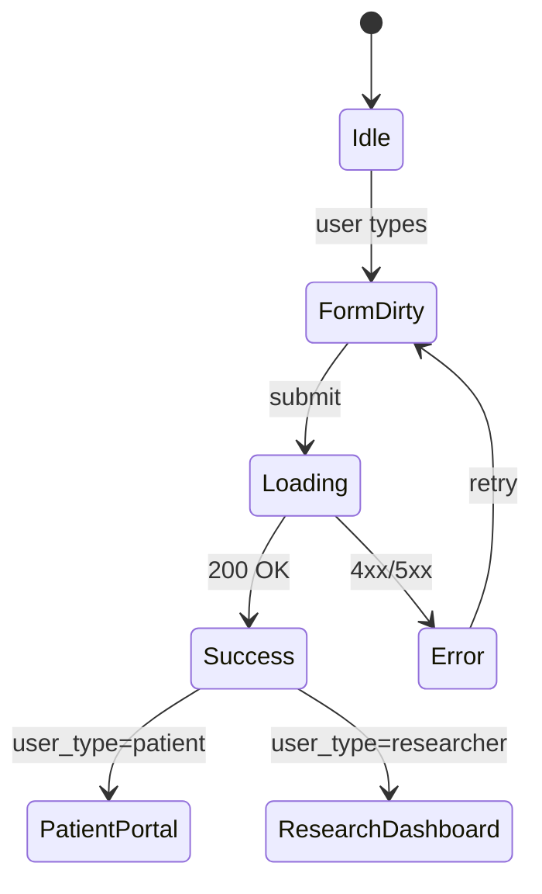
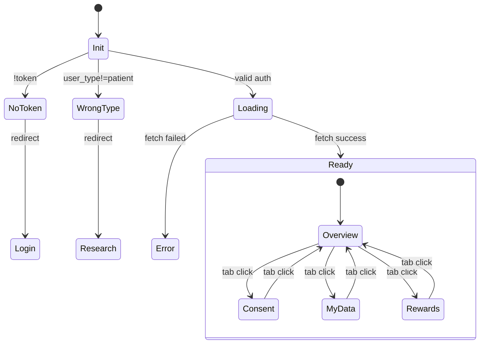
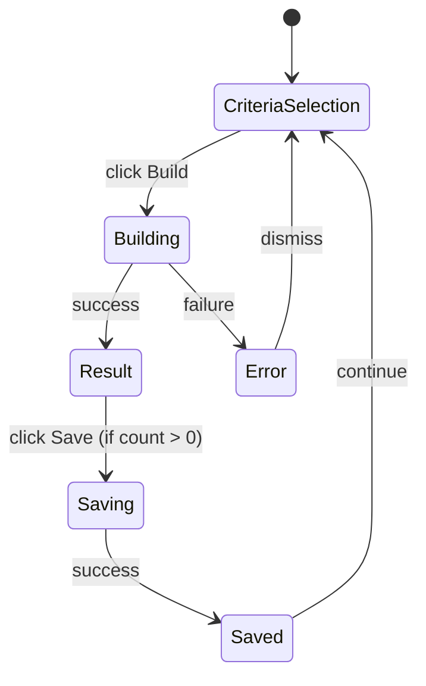

# HealthDB State Machine Diagrams

This document contains state machine diagrams for all major components in the HealthDB platform.

---

## 1. Authentication Flow

### 1.1 Login Component State Machine

```
┌─────────────────────────────────────────────────────────────────────────────┐
│                           LOGIN COMPONENT                                    │
├─────────────────────────────────────────────────────────────────────────────┤
│                                                                             │
│    ┌──────────┐                                                             │
│    │  IDLE    │ ◄─────────────────────────────────────────────┐             │
│    │          │                                               │             │
│    │ email='' │                                               │             │
│    │ pass=''  │                                               │             │
│    │ error='' │                                               │             │
│    └────┬─────┘                                               │             │
│         │                                                     │             │
│         │ [user types in fields]                              │             │
│         ▼                                                     │             │
│    ┌──────────────┐                                           │             │
│    │  FORM_DIRTY  │                                           │             │
│    │              │                                           │             │
│    │ email=input  │                                           │             │
│    │ pass=input   │                                           │             │
│    └──────┬───────┘                                           │             │
│           │                                                   │             │
│           │ [submit clicked]                                  │             │
│           ▼                                                   │             │
│    ┌──────────────┐                                           │             │
│    │   LOADING    │                                           │             │
│    │              │                                           │             │
│    │ isLoading=   │                                           │             │
│    │    true      │                                           │             │
│    └──────┬───────┘                                           │             │
│           │                                                   │             │
│           ├───────────────────┬───────────────────┐           │             │
│           │                   │                   │           │             │
│           ▼                   ▼                   │           │             │
│    ┌──────────────┐    ┌──────────────┐           │           │             │
│    │   SUCCESS    │    │    ERROR     │           │           │             │
│    │              │    │              │           │           │             │
│    │ token saved  │    │ error msg    │           │           │             │
│    │ user saved   │    │ displayed    │───────────┘           │             │
│    └──────┬───────┘    └──────────────┘                       │             │
│           │                                                   │             │
│           │ [check user_type]                                 │             │
│           │                                                   │             │
│           ├─────────────────────┐                             │             │
│           │                     │                             │             │
│           ▼                     ▼                             │             │
│    ┌──────────────┐      ┌──────────────┐                     │             │
│    │  REDIRECT    │      │  REDIRECT    │                     │             │
│    │  /patient    │      │  /research   │                     │             │
│    │              │      │              │                     │             │
│    │ user_type=   │      │ user_type=   │                     │             │
│    │   'patient'  │      │  'researcher'│                     │             │
│    └──────────────┘      └──────────────┘                     │             │
│                                                               │             │
└─────────────────────────────────────────────────────────────────────────────┘
```

### 1.2 Registration Component State Machine

```
┌─────────────────────────────────────────────────────────────────────────────┐
│                         REGISTRATION COMPONENT                               │
├─────────────────────────────────────────────────────────────────────────────┤
│                                                                             │
│    ┌──────────────────────────────────────────────┐                         │
│    │                   IDLE                        │                         │
│    │                                              │                         │
│    │  userType = 'researcher' | 'patient'        │                         │
│    │  name = ''                                  │                         │
│    │  email = ''                                 │                         │
│    │  password = ''                              │                         │
│    │  institution = ''                           │                         │
│    └───────────────────┬──────────────────────────┘                         │
│                        │                                                    │
│         ┌──────────────┴──────────────┐                                     │
│         │                             │                                     │
│         ▼                             ▼                                     │
│    ┌─────────────┐              ┌─────────────┐                             │
│    │ RESEARCHER  │◄────────────►│   PATIENT   │                             │
│    │    MODE     │  [toggle]    │    MODE     │                             │
│    │             │              │             │                             │
│    │ Shows:      │              │ Shows:      │                             │
│    │ - Name      │              │ - Name      │                             │
│    │ - Email     │              │ - Email     │                             │
│    │ - Institu-  │              │ - Password  │                             │
│    │   tion      │              │             │                             │
│    │ - Password  │              │ Benefits:   │                             │
│    │             │              │ - Contribute│                             │
│    │ Benefits:   │              │ - Control   │                             │
│    │ - Access    │              │ - Rewards   │                             │
│    │ - Cohorts   │              │             │                             │
│    │ - Collab    │              │             │                             │
│    └──────┬──────┘              └──────┬──────┘                             │
│           │                            │                                    │
│           └────────────┬───────────────┘                                    │
│                        │                                                    │
│                        │ [submit]                                           │
│                        ▼                                                    │
│                 ┌─────────────┐                                             │
│                 │   LOADING   │                                             │
│                 │             │                                             │
│                 │ isLoading=  │                                             │
│                 │    true     │                                             │
│                 └──────┬──────┘                                             │
│                        │                                                    │
│           ┌────────────┴────────────┐                                       │
│           │                         │                                       │
│           ▼                         ▼                                       │
│    ┌─────────────┐           ┌─────────────┐                                │
│    │   SUCCESS   │           │    ERROR    │                                │
│    │             │           │             │                                │
│    │ Redirect    │           │ Show error  │                                │
│    │ to /login   │           │ message     │──────► [retry] ──► IDLE        │
│    └─────────────┘           └─────────────┘                                │
│                                                                             │
└─────────────────────────────────────────────────────────────────────────────┘
```

---

## 2. Patient Portal State Machine

```
┌─────────────────────────────────────────────────────────────────────────────┐
│                          PATIENT PORTAL                                      │
├─────────────────────────────────────────────────────────────────────────────┤
│                                                                             │
│    ┌──────────────┐                                                         │
│    │    INIT      │                                                         │
│    │              │                                                         │
│    │ Check auth   │                                                         │
│    └──────┬───────┘                                                         │
│           │                                                                 │
│           ├─────────────────────┬─────────────────────┐                     │
│           │                     │                     │                     │
│           ▼                     ▼                     ▼                     │
│    ┌──────────────┐      ┌──────────────┐      ┌──────────────┐             │
│    │  NO_TOKEN    │      │ WRONG_TYPE   │      │   LOADING    │             │
│    │              │      │              │      │              │             │
│    │ Redirect to  │      │ user_type != │      │ Fetching:    │             │
│    │   /login     │      │  'patient'   │      │ - profile    │             │
│    │              │      │              │      │ - consents   │             │
│    │              │      │ Redirect to  │      │ - rewards    │             │
│    │              │      │  /research   │      │ - accessLog  │             │
│    └──────────────┘      └──────────────┘      └──────┬───────┘             │
│                                                       │                     │
│                                    ┌──────────────────┴──────────────────┐  │
│                                    │                                     │  │
│                                    ▼                                     ▼  │
│                             ┌──────────────┐                      ┌────────┐│
│                             │    ERROR     │                      │ READY  ││
│                             │              │                      │        ││
│                             │ Show error   │                      │ Data   ││
│                             │ Retry button │                      │ loaded ││
│                             └──────────────┘                      └───┬────┘│
│                                                                       │     │
│    ┌──────────────────────────────────────────────────────────────────┼─────┤
│    │                         ACTIVE TAB STATE                         │     │
│    ├──────────────────────────────────────────────────────────────────┘     │
│    │                                                                        │
│    │     ┌─────────────┐      ┌─────────────┐      ┌─────────────┐          │
│    │     │  OVERVIEW   │◄────►│   CONSENT   │◄────►│   MY DATA   │          │
│    │     │             │      │             │      │             │          │
│    │     │ - Stats     │      │ - List      │      │ - Empty     │          │
│    │     │ - Activity  │      │   consents  │      │   state     │          │
│    │     │ - Actions   │      │ - Sign new  │      │ - Connect   │          │
│    │     └──────┬──────┘      └─────────────┘      │   records   │          │
│    │            │                                  └─────────────┘          │
│    │            │                                                           │
│    │            └────────────────────────────┐                              │
│    │                                         │                              │
│    │     ┌─────────────┐                     │                              │
│    │     │   REWARDS   │◄────────────────────┘                              │
│    │     │             │                                                    │
│    │     │ - Balance   │                                                    │
│    │     │ - History   │                                                    │
│    │     │ - Redeem    │                                                    │
│    │     │   (disabled │                                                    │
│    │     │   if 0 pts) │                                                    │
│    │     └─────────────┘                                                    │
│    │                                                                        │
│    └────────────────────────────────────────────────────────────────────────┘
│                                                                             │
└─────────────────────────────────────────────────────────────────────────────┘
```

---

## 3. Researcher Dashboard State Machine

```
┌─────────────────────────────────────────────────────────────────────────────┐
│                       RESEARCHER DASHBOARD                                   │
├─────────────────────────────────────────────────────────────────────────────┤
│                                                                             │
│    ┌──────────────┐                                                         │
│    │    INIT      │                                                         │
│    │              │                                                         │
│    │ Check auth   │                                                         │
│    └──────┬───────┘                                                         │
│           │                                                                 │
│           ├─────────────────────┬─────────────────────┐                     │
│           │                     │                     │                     │
│           ▼                     ▼                     ▼                     │
│    ┌──────────────┐      ┌──────────────┐      ┌──────────────┐             │
│    │  NO_TOKEN    │      │ WRONG_TYPE   │      │   LOADING    │             │
│    │              │      │              │      │              │             │
│    │ Redirect to  │      │ user_type == │      │ Fetching     │             │
│    │   /login     │      │  'patient'   │      │ saved cohorts│             │
│    │              │      │              │      │              │             │
│    │              │      │ Redirect to  │      │              │             │
│    │              │      │  /patient    │      │              │             │
│    └──────────────┘      └──────────────┘      └──────┬───────┘             │
│                                                       │                     │
│                                                       ▼                     │
│    ┌────────────────────────────────────────────────────────────────────────┤
│    │                         ACTIVE TAB STATE                               │
│    ├────────────────────────────────────────────────────────────────────────┤
│    │                                                                        │
│    │  ┌──────────────────────────────────────────────────────────────────┐  │
│    │  │                    COHORT BUILDER TAB                            │  │
│    │  ├──────────────────────────────────────────────────────────────────┤  │
│    │  │                                                                  │  │
│    │  │    ┌─────────────┐                                               │  │
│    │  │    │ CRITERIA    │                                               │  │
│    │  │    │ SELECTION   │                                               │  │
│    │  │    │             │                                               │  │
│    │  │    │ cancerTypes │                                               │  │
│    │  │    │ ageMin/Max  │                                               │  │
│    │  │    │ stages      │                                               │  │
│    │  │    │ treatments  │                                               │  │
│    │  │    │ followup    │                                               │  │
│    │  │    └──────┬──────┘                                               │  │
│    │  │           │                                                      │  │
│    │  │           │ [Build Cohort clicked]                               │  │
│    │  │           ▼                                                      │  │
│    │  │    ┌─────────────┐                                               │  │
│    │  │    │  BUILDING   │                                               │  │
│    │  │    │             │                                               │  │
│    │  │    │ isBuilding= │                                               │  │
│    │  │    │    true     │                                               │  │
│    │  │    └──────┬──────┘                                               │  │
│    │  │           │                                                      │  │
│    │  │           ├───────────────────────┐                              │  │
│    │  │           │                       │                              │  │
│    │  │           ▼                       ▼                              │  │
│    │  │    ┌─────────────┐         ┌─────────────┐                       │  │
│    │  │    │   RESULT    │         │    ERROR    │                       │  │
│    │  │    │             │         │             │                       │  │
│    │  │    │ patient_cnt │         │ Show alert  │──► CRITERIA_SELECTION │  │
│    │  │    │ data_points │         │             │                       │  │
│    │  │    │ diagnosis   │         └─────────────┘                       │  │
│    │  │    │ treatment   │                                               │  │
│    │  │    │ molecular   │                                               │  │
│    │  │    └──────┬──────┘                                               │  │
│    │  │           │                                                      │  │
│    │  │           │ [Save Cohort clicked] (if patient_count > 0)         │  │
│    │  │           ▼                                                      │  │
│    │  │    ┌─────────────┐                                               │  │
│    │  │    │   SAVING    │                                               │  │
│    │  │    │             │                                               │  │
│    │  │    │ prompt name │                                               │  │
│    │  │    │ POST /save  │                                               │  │
│    │  │    └──────┬──────┘                                               │  │
│    │  │           │                                                      │  │
│    │  │           ▼                                                      │  │
│    │  │    ┌─────────────┐                                               │  │
│    │  │    │    SAVED    │                                               │  │
│    │  │    │             │                                               │  │
│    │  │    │ Add to      │                                               │  │
│    │  │    │ savedCohorts│                                               │  │
│    │  │    │ Show alert  │                                               │  │
│    │  │    └─────────────┘                                               │  │
│    │  │                                                                  │  │
│    │  └──────────────────────────────────────────────────────────────────┘  │
│    │                                                                        │
│    │                              ▲                                         │
│    │                              │ [tab toggle]                            │
│    │                              ▼                                         │
│    │                                                                        │
│    │  ┌──────────────────────────────────────────────────────────────────┐  │
│    │  │                    SAVED COHORTS TAB                             │  │
│    │  ├──────────────────────────────────────────────────────────────────┤  │
│    │  │                                                                  │  │
│    │  │    ┌─────────────┐      ┌─────────────┐      ┌─────────────┐     │  │
│    │  │    │   LOADING   │─────►│    EMPTY    │  OR  │  HAS_DATA   │     │  │
│    │  │    │             │      │             │      │             │     │  │
│    │  │    │             │      │ "No saved   │      │ List of     │     │  │
│    │  │    │             │      │  cohorts"   │      │ cohorts     │     │  │
│    │  │    │             │      │             │      │             │     │  │
│    │  │    │             │      │ [Build      │      │ - name      │     │  │
│    │  │    │             │      │  Cohort]────┼──────► - desc     │     │  │
│    │  │    │             │      │  button     │      │ - date      │     │  │
│    │  │    │             │      │             │      │ - patients  │     │  │
│    │  │    └─────────────┘      └─────────────┘      └─────────────┘     │  │
│    │  │                                                                  │  │
│    │  └──────────────────────────────────────────────────────────────────┘  │
│    │                                                                        │
│    └────────────────────────────────────────────────────────────────────────┘
│                                                                             │
└─────────────────────────────────────────────────────────────────────────────┘
```

---

## 4. Data Marketplace State Machine

```
┌─────────────────────────────────────────────────────────────────────────────┐
│                          DATA MARKETPLACE                                    │
├─────────────────────────────────────────────────────────────────────────────┤
│                                                                             │
│    ┌──────────────┐                                                         │
│    │   LOADING    │                                                         │
│    │              │                                                         │
│    │ Fetching     │                                                         │
│    │ /products    │                                                         │
│    └──────┬───────┘                                                         │
│           │                                                                 │
│           ├───────────────────────┬────────────────────────┐                │
│           │                       │                        │                │
│           ▼                       ▼                        ▼                │
│    ┌──────────────┐        ┌──────────────┐        ┌──────────────┐         │
│    │    ERROR     │        │    EMPTY     │        │  HAS_PRODUCTS │         │
│    │              │        │              │        │              │         │
│    │ Fetch failed │        │ products=[]  │        │ products=[..]│         │
│    │              │        │              │        │              │         │
│    │              │        │ "No Datasets │        │              │         │
│    │              │        │  Available"  │        │              │         │
│    └──────────────┘        │              │        └──────┬───────┘         │
│                            │ - Partner    │               │                 │
│                            │   With Us    │               │                 │
│                            │ - Contribute │               │                 │
│                            └──────────────┘               │                 │
│                                                           │                 │
│    ┌──────────────────────────────────────────────────────┼─────────────────┤
│    │                      FILTER STATE                    │                 │
│    ├──────────────────────────────────────────────────────┘                 │
│    │                                                                        │
│    │    ┌─────────────────────────────────────────────────────────────┐     │
│    │    │                    SEARCH & CATEGORY                        │     │
│    │    │                                                             │     │
│    │    │   searchQuery: string                                       │     │
│    │    │   selectedCategory: 'all' | 'Hematologic' | 'Solid Tumor'   │     │
│    │    │                     | 'Cell Therapy'                        │     │
│    │    │                                                             │     │
│    │    │   ┌─────────────────────────────────────────────────────┐   │     │
│    │    │   │              FILTERED PRODUCTS                      │   │     │
│    │    │   │                                                     │   │     │
│    │    │   │   products.filter(p =>                              │   │     │
│    │    │   │     matchesSearch(p) &&                             │   │     │
│    │    │   │     matchesCategory(p) &&                           │   │     │
│    │    │   │     p.patientCount > 0                              │   │     │
│    │    │   │   )                                                 │   │     │
│    │    │   │                                                     │   │     │
│    │    │   └─────────────────────────────────────────────────────┘   │     │
│    │    └─────────────────────────────────────────────────────────────┘     │
│    │                                                                        │
│    └────────────────────────────────────────────────────────────────────────┤
│                                                                             │
│    ┌────────────────────────────────────────────────────────────────────────┤
│    │                      MODAL STATE                                       │
│    ├────────────────────────────────────────────────────────────────────────┤
│    │                                                                        │
│    │     ┌─────────────┐                      ┌─────────────┐               │
│    │     │   CLOSED    │◄────────────────────►│    OPEN     │               │
│    │     │             │   [click product]    │             │               │
│    │     │ selected=   │   [click close]      │ selected=   │               │
│    │     │    null     │                      │   product   │               │
│    │     │             │                      │             │               │
│    │     │             │                      │ Shows:      │               │
│    │     │             │                      │ - Details   │               │
│    │     │             │                      │ - Stats     │               │
│    │     │             │                      │ - Pricing   │               │
│    │     │             │                      │ - Actions   │               │
│    │     └─────────────┘                      └─────────────┘               │
│    │                                                                        │
│    └────────────────────────────────────────────────────────────────────────┘
│                                                                             │
└─────────────────────────────────────────────────────────────────────────────┘
```

---

## 5. Global Application State Machine

```
┌─────────────────────────────────────────────────────────────────────────────┐
│                       GLOBAL APPLICATION STATE                               │
├─────────────────────────────────────────────────────────────────────────────┤
│                                                                             │
│                        ┌─────────────────┐                                  │
│                        │  UNAUTHENTICATED │                                  │
│                        │                 │                                  │
│                        │ token = null    │                                  │
│                        │ user = null     │                                  │
│                        └────────┬────────┘                                  │
│                                 │                                           │
│          ┌──────────────────────┼──────────────────────┐                    │
│          │                      │                      │                    │
│          ▼                      ▼                      ▼                    │
│   ┌─────────────┐        ┌─────────────┐        ┌─────────────┐             │
│   │   LANDING   │        │    LOGIN    │        │  REGISTER   │             │
│   │    PAGE     │───────►│    PAGE     │◄──────►│    PAGE     │             │
│   │             │        │             │        │             │             │
│   │ Public      │        │             │        │             │             │
│   │ content     │        │             │        │             │             │
│   └─────────────┘        └──────┬──────┘        └─────────────┘             │
│                                 │                                           │
│                                 │ [successful login]                        │
│                                 │                                           │
│                                 ▼                                           │
│                        ┌─────────────────┐                                  │
│                        │  AUTHENTICATED   │                                  │
│                        │                 │                                  │
│                        │ token = JWT     │                                  │
│                        │ user = {...}    │                                  │
│                        └────────┬────────┘                                  │
│                                 │                                           │
│               ┌─────────────────┴─────────────────┐                         │
│               │                                   │                         │
│               ▼                                   ▼                         │
│       ┌───────────────┐                   ┌───────────────┐                 │
│       │ PATIENT_USER  │                   │RESEARCHER_USER│                 │
│       │               │                   │               │                 │
│       │ user_type =   │                   │ user_type =   │                 │
│       │  'patient'    │                   │  'researcher' │                 │
│       └───────┬───────┘                   └───────┬───────┘                 │
│               │                                   │                         │
│               ▼                                   ▼                         │
│       ┌───────────────┐                   ┌───────────────┐                 │
│       │ /patient      │                   │ /research     │                 │
│       │ /marketplace  │                   │ /marketplace  │                 │
│       └───────────────┘                   └───────────────┘                 │
│                                                                             │
│                        ┌─────────────────┐                                  │
│                        │     LOGOUT      │                                  │
│                        │                 │                                  │
│                        │ Clear token     │──────► UNAUTHENTICATED           │
│                        │ Clear user      │                                  │
│                        └─────────────────┘                                  │
│                                                                             │
└─────────────────────────────────────────────────────────────────────────────┘
```

---

## 6. Consent Management State Machine (Patient)

```
┌─────────────────────────────────────────────────────────────────────────────┐
│                       CONSENT MANAGEMENT                                     │
├─────────────────────────────────────────────────────────────────────────────┤
│                                                                             │
│    ┌─────────────────────────────────────────────────────────────────────┐  │
│    │                        CONSENT STATES                               │  │
│    └─────────────────────────────────────────────────────────────────────┘  │
│                                                                             │
│         ┌──────────────┐                                                    │
│         │  NO_CONSENT  │                                                    │
│         │              │                                                    │
│         │ consents=[]  │                                                    │
│         │              │                                                    │
│         │ "No consents │                                                    │
│         │  signed yet" │                                                    │
│         └──────┬───────┘                                                    │
│                │                                                            │
│                │ [Sign New Consent]                                         │
│                ▼                                                            │
│         ┌──────────────┐                                                    │
│         │   PENDING    │                                                    │
│         │              │                                                    │
│         │ status =     │                                                    │
│         │  'pending'   │                                                    │
│         │              │                                                    │
│         │ Awaiting     │                                                    │
│         │ signature    │                                                    │
│         └──────┬───────┘                                                    │
│                │                                                            │
│                │ [User signs]                                               │
│                ▼                                                            │
│         ┌──────────────┐                                                    │
│         │    ACTIVE    │                                                    │
│         │              │                                                    │
│         │ status =     │                                                    │
│         │  'active'    │                                                    │
│         │              │                                                    │
│         │ signed_date  │                                                    │
│         │ set          │                                                    │
│         └──────┬───────┘                                                    │
│                │                                                            │
│                ├───────────────────────┐                                    │
│                │                       │                                    │
│                │ [User revokes]        │ [Expires]                          │
│                ▼                       ▼                                    │
│         ┌──────────────┐        ┌──────────────┐                            │
│         │   REVOKED    │        │   EXPIRED    │                            │
│         │              │        │              │                            │
│         │ status =     │        │ status =     │                            │
│         │  'revoked'   │        │  'expired'   │                            │
│         │              │        │              │                            │
│         │ Can sign     │        │ Can sign     │                            │
│         │ new consent  │        │ new consent  │                            │
│         └──────────────┘        └──────────────┘                            │
│                                                                             │
└─────────────────────────────────────────────────────────────────────────────┘
```

---

## 7. Cohort Criteria State Machine

```
┌─────────────────────────────────────────────────────────────────────────────┐
│                       COHORT CRITERIA                                        │
├─────────────────────────────────────────────────────────────────────────────┤
│                                                                             │
│   Each criteria type has toggle behavior:                                   │
│                                                                             │
│   ┌─────────────────────────────────────────────────────────────────────┐   │
│   │                     MULTI-SELECT CRITERIA                           │   │
│   │                                                                     │   │
│   │   [DLBCL] [AML] [ALL] [CLL] [MM] ...                               │   │
│   │                                                                     │   │
│   │   ┌──────────────┐         ┌──────────────┐                        │   │
│   │   │  UNSELECTED  │◄───────►│   SELECTED   │                        │   │
│   │   │              │ [click] │              │                        │   │
│   │   │ border only  │         │ filled bg    │                        │   │
│   │   │ white/50     │         │ white/black  │                        │   │
│   │   └──────────────┘         └──────────────┘                        │   │
│   │                                                                     │   │
│   │   State array: cancerTypes[] / diseaseStages[] / treatmentTypes[]  │   │
│   │                                                                     │   │
│   │   Toggle logic:                                                     │   │
│   │   if (array.includes(item)) {                                       │   │
│   │     array = array.filter(i => i !== item)  // remove               │   │
│   │   } else {                                                          │   │
│   │     array = [...array, item]               // add                  │   │
│   │   }                                                                 │   │
│   │                                                                     │   │
│   └─────────────────────────────────────────────────────────────────────┘   │
│                                                                             │
│   ┌─────────────────────────────────────────────────────────────────────┐   │
│   │                     RANGE CRITERIA                                  │   │
│   │                                                                     │   │
│   │   Age: [___] to [___]     Follow-up: [___] months                   │   │
│   │                                                                     │   │
│   │   ┌──────────────┐         ┌──────────────┐                        │   │
│   │   │    EMPTY     │◄───────►│  HAS_VALUE   │                        │   │
│   │   │              │ [input] │              │                        │   │
│   │   │ value = ''   │         │ value = num  │                        │   │
│   │   └──────────────┘         └──────────────┘                        │   │
│   │                                                                     │   │
│   │   Validation: parseInt() or null if empty                          │   │
│   │                                                                     │   │
│   └─────────────────────────────────────────────────────────────────────┘   │
│                                                                             │
│   ┌─────────────────────────────────────────────────────────────────────┐   │
│   │                     BUILD RESULT                                    │   │
│   │                                                                     │   │
│   │   ┌──────────────┐                                                  │   │
│   │   │  NO_RESULT   │  (cohortResult = null)                          │   │
│   │   │              │                                                  │   │
│   │   │ "Select      │                                                  │   │
│   │   │  criteria    │                                                  │   │
│   │   │  and build"  │                                                  │   │
│   │   └──────┬───────┘                                                  │   │
│   │          │                                                          │   │
│   │          │ [Build Cohort success]                                   │   │
│   │          ▼                                                          │   │
│   │   ┌──────────────┐         ┌──────────────┐                        │   │
│   │   │ ZERO_RESULTS │   OR    │ HAS_RESULTS  │                        │   │
│   │   │              │         │              │                        │   │
│   │   │ patient_cnt  │         │ patient_cnt  │                        │   │
│   │   │    = 0       │         │    > 0       │                        │   │
│   │   │              │         │              │                        │   │
│   │   │ No save btn  │         │ Save Cohort  │                        │   │
│   │   │              │         │ button shown │                        │   │
│   │   └──────────────┘         └──────────────┘                        │   │
│   │                                                                     │   │
│   └─────────────────────────────────────────────────────────────────────┘   │
│                                                                             │
└─────────────────────────────────────────────────────────────────────────────┘
```

---

## State Summary Table

| Component | States | Key Transitions |
|-----------|--------|-----------------|
| **Login** | IDLE → LOADING → SUCCESS/ERROR | Form submit triggers API call |
| **Register** | RESEARCHER_MODE ↔ PATIENT_MODE → LOADING → SUCCESS/ERROR | User type toggle, form submit |
| **Patient Portal** | LOADING → READY → TAB_OVERVIEW/CONSENT/DATA/REWARDS | Auth check, tab navigation |
| **Researcher Dashboard** | LOADING → COHORT_BUILDER/SAVED_COHORTS | Auth check, tab navigation |
| **Cohort Builder** | CRITERIA → BUILDING → RESULT → SAVING | Build → Save flow |
| **Data Marketplace** | LOADING → EMPTY/HAS_PRODUCTS → MODAL_OPEN/CLOSED | Fetch, filter, product detail |
| **Consent** | NO_CONSENT → PENDING → ACTIVE → REVOKED/EXPIRED | Lifecycle management |

---

## Mermaid Diagrams (Alternative Format)

For rendering in tools that support Mermaid:

### Login Flow


### Patient Portal


### Cohort Builder


