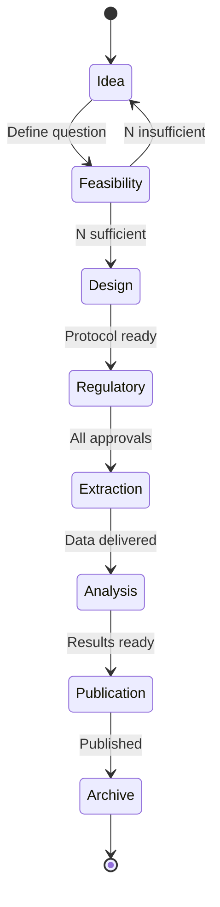
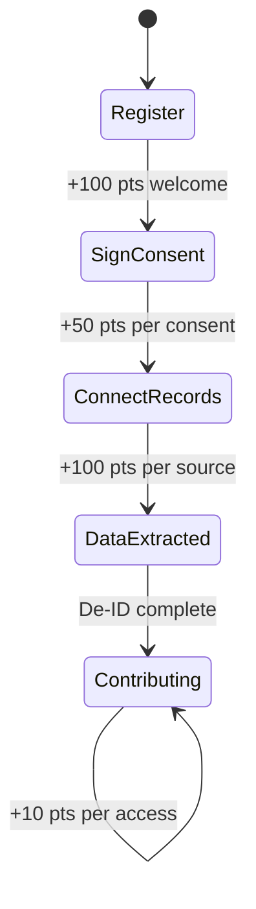
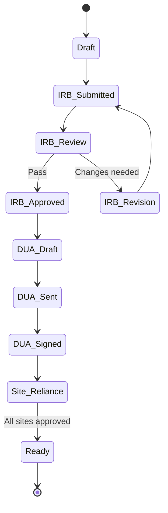

# HealthDB Platform State Machine Diagrams

This document contains comprehensive state machine diagrams for all major workflows in the HealthDB platform.

---

## Table of Contents

1. [Authentication Flow](#1-authentication-flow)
2. [Patient Portal](#2-patient-portal)
3. [Researcher Dashboard](#3-researcher-dashboard)
4. [Consent Management](#4-consent-management)
5. [Medical Records Connection](#5-medical-records-connection)
6. [Cohort Builder Workflow](#6-cohort-builder-workflow)
7. [Regulatory Pipeline](#7-regulatory-pipeline)
8. [EMR Integration Hub](#8-emr-integration-hub)
9. [Data Extraction Pipeline](#9-data-extraction-pipeline)
10. [Study Lifecycle](#10-study-lifecycle)
11. [Data Marketplace](#11-data-marketplace)
12. [Global Application State](#12-global-application-state)
13. [System Architecture](#13-system-architecture)

---

## 1. Authentication Flow

### 1.1 Login Component

```
┌─────────────────────────────────────────────────────────────────┐
│                      LOGIN COMPONENT                            │
├─────────────────────────────────────────────────────────────────┤
│                                                                 │
│    ┌──────────┐                                                 │
│    │   IDLE   │ ◄────────────────────────────────┐              │
│    │          │                                  │              │
│    │ email='' │                                  │              │
│    │ pass=''  │                                  │              │
│    └────┬─────┘                                  │              │
│         │ [user types]                           │              │
│         ▼                                        │              │
│    ┌──────────────┐                              │              │
│    │  FORM_DIRTY  │                              │              │
│    └──────┬───────┘                              │              │
│           │ [submit]                             │              │
│           ▼                                      │              │
│    ┌──────────────┐                              │              │
│    │   LOADING    │                              │              │
│    │ isLoading=   │                              │              │
│    │   true       │                              │              │
│    └──────┬───────┘                              │              │
│           │                                      │              │
│           ├─────────────────┐                    │              │
│           ▼                 ▼                    │              │
│    ┌──────────────┐  ┌──────────────┐            │              │
│    │   SUCCESS    │  │    ERROR     │────────────┘              │
│    │              │  │              │                           │
│    │ token saved  │  │ show message │                           │
│    └──────┬───────┘  └──────────────┘                           │
│           │                                                     │
│           ├─────────────────┐                                   │
│           ▼                 ▼                                   │
│    ┌──────────────┐  ┌──────────────┐                           │
│    │  → /patient  │  │  → /research │                           │
│    │ (patient)    │  │ (researcher) │                           │
│    └──────────────┘  └──────────────┘                           │
│                                                                 │
└─────────────────────────────────────────────────────────────────┘
```

### 1.2 Registration Component

```
┌─────────────────────────────────────────────────────────────────┐
│                    REGISTRATION COMPONENT                       │
├─────────────────────────────────────────────────────────────────┤
│                                                                 │
│    ┌─────────────┐              ┌─────────────┐                 │
│    │ RESEARCHER  │◄────────────►│   PATIENT   │                 │
│    │    MODE     │   [toggle]   │    MODE     │                 │
│    │             │              │             │                 │
│    │ Shows:      │              │ Shows:      │                 │
│    │ - Name      │              │ - Name      │                 │
│    │ - Email     │              │ - Email     │                 │
│    │ - Org       │              │ - Password  │                 │
│    │ - Password  │              │             │                 │
│    └──────┬──────┘              └──────┬──────┘                 │
│           │                            │                        │
│           └────────────┬───────────────┘                        │
│                        │ [submit]                               │
│                        ▼                                        │
│                 ┌─────────────┐                                 │
│                 │   LOADING   │                                 │
│                 └──────┬──────┘                                 │
│                        │                                        │
│           ┌────────────┴────────────┐                           │
│           ▼                         ▼                           │
│    ┌─────────────┐           ┌─────────────┐                    │
│    │   SUCCESS   │           │    ERROR    │─► [retry] ─► IDLE  │
│    │ → /login    │           │ show error  │                    │
│    └─────────────┘           └─────────────┘                    │
│                                                                 │
└─────────────────────────────────────────────────────────────────┘
```

---

## 2. Patient Portal

### 2.1 Main State Machine

```
┌─────────────────────────────────────────────────────────────────┐
│                      PATIENT PORTAL                             │
├─────────────────────────────────────────────────────────────────┤
│                                                                 │
│    ┌──────────────┐                                             │
│    │     INIT     │                                             │
│    │  Check auth  │                                             │
│    └──────┬───────┘                                             │
│           │                                                     │
│           ├─────────────────┬─────────────────┐                 │
│           ▼                 ▼                 ▼                 │
│    ┌──────────────┐  ┌──────────────┐  ┌──────────────┐         │
│    │  NO_TOKEN    │  │ WRONG_TYPE   │  │   LOADING    │         │
│    │ → /login     │  │ → /research  │  │ Fetching...  │         │
│    └──────────────┘  └──────────────┘  └──────┬───────┘         │
│                                               │                 │
│                                    ┌──────────┴──────────┐      │
│                                    ▼                     ▼      │
│                             ┌──────────────┐      ┌─────────┐   │
│                             │    ERROR     │      │  READY  │   │
│                             │ Retry button │      │         │   │
│                             └──────────────┘      └────┬────┘   │
│                                                        │        │
│    ┌───────────────────────────────────────────────────┼────────┤
│    │                    ACTIVE TAB STATE               │        │
│    ├───────────────────────────────────────────────────┘        │
│    │                                                            │
│    │  ┌──────────┐  ┌──────────┐  ┌──────────┐  ┌──────────┐   │
│    │  │ OVERVIEW │◄►│ CONSENT  │◄►│ MY DATA  │◄►│ REWARDS  │   │
│    │  │          │  │          │  │          │  │          │   │
│    │  │ - Stats  │  │ - Active │  │ - Sources│  │ - Balance│   │
│    │  │ - Steps  │  │ - Sign   │  │ - Connect│  │ - Earn   │   │
│    │  │ - Log    │  │ - Revoke │  │ - Data   │  │ - Redeem │   │
│    │  └──────────┘  └──────────┘  └──────────┘  └──────────┘   │
│    │                                                            │
│    └────────────────────────────────────────────────────────────┘
│                                                                 │
└─────────────────────────────────────────────────────────────────┘
```

### 2.2 Patient Journey Flowchart

```
┌─────────────────────────────────────────────────────────────────┐
│                    PATIENT JOURNEY                              │
├─────────────────────────────────────────────────────────────────┤
│                                                                 │
│    [REGISTER] ──► [100 pts welcome bonus]                       │
│         │                                                       │
│         ▼                                                       │
│    ┌─────────────────────────────────────────────────────┐      │
│    │              SIGN CONSENT                            │      │
│    │                                                     │      │
│    │  ┌─────────────┐   ┌─────────────┐   ┌───────────┐ │      │
│    │  │ Research    │   │ Trial       │   │ AI/ML     │ │      │
│    │  │ Data Share  │   │ Matching    │   │ Training  │ │      │
│    │  │ +50 pts     │   │ +50 pts     │   │ +50 pts   │ │      │
│    │  └──────┬──────┘   └──────┬──────┘   └─────┬─────┘ │      │
│    │         │                 │                │       │      │
│    │         └────────────┬────┴───────────────┘        │      │
│    └──────────────────────┼─────────────────────────────┘      │
│                           │                                     │
│                           ▼                                     │
│    ┌─────────────────────────────────────────────────────┐      │
│    │            CONNECT MEDICAL RECORDS                  │      │
│    │                                                     │      │
│    │  ┌─────────────┐   ┌─────────────┐   ┌───────────┐ │      │
│    │  │ Epic        │   │ Cerner      │   │ Manual    │ │      │
│    │  │ MyChart     │   │ Portal      │   │ Upload    │ │      │
│    │  │ +100 pts    │   │ +100 pts    │   │ +100 pts  │ │      │
│    │  └──────┬──────┘   └──────┬──────┘   └─────┬─────┘ │      │
│    │         │                 │                │       │      │
│    │         └────────────┬────┴───────────────┘        │      │
│    └──────────────────────┼─────────────────────────────┘      │
│                           │                                     │
│                           ▼                                     │
│    ┌─────────────────────────────────────────────────────┐      │
│    │             DATA EXTRACTION                          │      │
│    │                                                     │      │
│    │  Demographics → Diagnosis → Treatment → Labs →      │      │
│    │  Molecular → Outcomes                               │      │
│    │                                                     │      │
│    │  De-identification applied automatically            │      │
│    └──────────────────────┬──────────────────────────────┘      │
│                           │                                     │
│                           ▼                                     │
│    ┌─────────────────────────────────────────────────────┐      │
│    │             CONTRIBUTE TO RESEARCH                   │      │
│    │                                                     │      │
│    │  +10 pts per data access by approved researcher     │      │
│    │                                                     │      │
│    │  Earn up to $500/year in rewards                    │      │
│    └─────────────────────────────────────────────────────┘      │
│                                                                 │
└─────────────────────────────────────────────────────────────────┘
```

---

## 3. Researcher Dashboard

### 3.1 Main State Machine

```
┌─────────────────────────────────────────────────────────────────┐
│                    RESEARCHER DASHBOARD                         │
├─────────────────────────────────────────────────────────────────┤
│                                                                 │
│    ┌──────────────┐                                             │
│    │     INIT     │                                             │
│    └──────┬───────┘                                             │
│           │                                                     │
│           ├─────────────────┬─────────────────┐                 │
│           ▼                 ▼                 ▼                 │
│    ┌──────────────┐  ┌──────────────┐  ┌──────────────┐         │
│    │  NO_TOKEN    │  │ WRONG_TYPE   │  │   LOADING    │         │
│    │ → /login     │  │ → /patient   │  │              │         │
│    └──────────────┘  └──────────────┘  └──────┬───────┘         │
│                                               │                 │
│                                               ▼                 │
│    ┌────────────────────────────────────────────────────────────┤
│    │                    ACTIVE TAB STATE                        │
│    ├────────────────────────────────────────────────────────────┤
│    │                                                            │
│    │  ┌──────────────┐  ┌──────────────┐  ┌──────────────┐     │
│    │  │ COHORT       │  │ MY STUDIES   │  │ REGULATORY   │     │
│    │  │ BUILDER      │  │              │  │ STATUS       │     │
│    │  │              │  │ - Active     │  │              │     │
│    │  │ - Criteria   │  │ - Saved      │  │ - IRB        │     │
│    │  │ - Variables  │  │ - Convert    │  │ - DUA        │     │
│    │  │ - Feasibility│  │   to study   │  │ - Sites      │     │
│    │  └──────────────┘  └──────────────┘  └──────────────┘     │
│    │                                                            │
│    └────────────────────────────────────────────────────────────┘
│                                                                 │
└─────────────────────────────────────────────────────────────────┘
```

---

## 4. Consent Management

### 4.1 Consent Lifecycle

```
┌─────────────────────────────────────────────────────────────────┐
│                    CONSENT LIFECYCLE                            │
├─────────────────────────────────────────────────────────────────┤
│                                                                 │
│         ┌──────────────┐                                        │
│         │  NO_CONSENT  │                                        │
│         │ consents=[]  │                                        │
│         └──────┬───────┘                                        │
│                │ [view templates]                               │
│                ▼                                                │
│         ┌──────────────────┐                                    │
│         │  VIEW_TEMPLATES  │                                    │
│         │                  │                                    │
│         │ • Research Data  │                                    │
│         │ • Trial Match    │                                    │
│         │ • AI/ML Training │                                    │
│         └──────┬───────────┘                                    │
│                │ [click Review & Sign]                          │
│                ▼                                                │
│         ┌──────────────────┐                                    │
│         │   MODAL_OPEN     │                                    │
│         │                  │                                    │
│         │ Reading content  │                                    │
│         └──────┬───────────┘                                    │
│                │                                                │
│                ├────────────────────────┐                       │
│                ▼                        ▼                       │
│         ┌──────────────┐        ┌──────────────┐                │
│         │    CANCEL    │        │   SIGNING    │                │
│         │ close modal  │        │ isSubmitting │                │
│         └──────────────┘        └──────┬───────┘                │
│                                        │                        │
│                         ┌──────────────┴──────────────┐         │
│                         ▼                             ▼         │
│                  ┌──────────────┐             ┌──────────────┐  │
│                  │   SUCCESS    │             │    ERROR     │  │
│                  │ +50 points   │             │ show message │  │
│                  │ status=active│             └──────────────┘  │
│                  └──────┬───────┘                               │
│                         │                                       │
│                         ▼                                       │
│                  ┌──────────────────┐                           │
│                  │  CONSENT_ACTIVE  │                           │
│                  │ status="active"  │                           │
│                  │ expires_at=date  │                           │
│                  └──────┬───────────┘                           │
│                         │                                       │
│                         ├────────────────────┐                  │
│                         │                    │                  │
│                         ▼                    ▼                  │
│                  ┌──────────────┐     ┌──────────────┐          │
│                  │   REVOKED    │     │   EXPIRED    │          │
│                  │ user clicked │     │ time elapsed │          │
│                  │ revoke btn   │     │              │          │
│                  └──────────────┘     └──────────────┘          │
│                                                                 │
└─────────────────────────────────────────────────────────────────┘
```

### 4.2 Consent Types Table

| Type | Description | Duration | Data Categories | Points |
|------|-------------|----------|-----------------|--------|
| research_data_sharing | Share de-identified data for research | 24 months | demographics, diagnosis, treatment, lab_results, outcomes | 50 |
| clinical_trial_matching | Allow trial eligibility matching | 12 months | demographics, diagnosis, treatment | 50 |
| ai_ml_training | Anonymized data for AI model training | 36 months | demographics, diagnosis, treatment, molecular, outcomes | 50 |

---

## 5. Medical Records Connection

### 5.1 Connection Flow

```
┌─────────────────────────────────────────────────────────────────┐
│                MEDICAL RECORDS CONNECTION FLOW                  │
├─────────────────────────────────────────────────────────────────┤
│                                                                 │
│    ┌─────────────────┐                                          │
│    │   NO_CONSENT    │                                          │
│    │ "Sign consent   │                                          │
│    │  first"         │                                          │
│    └────────┬────────┘                                          │
│             │ [consent not active]                              │
│             │                                                   │
│    ┌────────▼────────┐                                          │
│    │   HAS_CONSENT   │                                          │
│    │ research_data_  │                                          │
│    │ sharing=active  │                                          │
│    └────────┬────────┘                                          │
│             │ [click Connect Records]                           │
│             ▼                                                   │
│    ┌─────────────────┐                                          │
│    │  SOURCE_SELECT  │                                          │
│    │                 │                                          │
│    │ • Epic MyChart  │                                          │
│    │ • Cerner        │                                          │
│    │ • Manual Upload │                                          │
│    └────────┬────────┘                                          │
│             │ [select source]                                   │
│             ▼                                                   │
│    ┌─────────────────┐                                          │
│    │   CONNECTING    │                                          │
│    │ status=pending  │                                          │
│    └────────┬────────┘                                          │
│             │ [background task]                                 │
│             ▼                                                   │
│    ┌─────────────────────┐                                      │
│    │   DATA_EXTRACTING   │                                      │
│    │ De-identification   │                                      │
│    │ in progress...      │                                      │
│    └─────────┬───────────┘                                      │
│              │                                                  │
│              ├────────────────────────────┐                     │
│              ▼                            ▼                     │
│    ┌─────────────────────┐      ┌─────────────────┐             │
│    │     CONNECTED       │      │      ERROR      │             │
│    │ status=connected    │      │ error_message   │             │
│    │ records_synced=N    │      └─────────────────┘             │
│    │ +100 points         │                                      │
│    └─────────────────────┘                                      │
│                                                                 │
└─────────────────────────────────────────────────────────────────┘
```

### 5.2 De-identified Data Categories

| Category | Data Type | Sample Fields |
|----------|-----------|---------------|
| demographics | age_range | age_range, sex, race |
| diagnosis | cancer_diagnosis | cancer_type, stage, diagnosis_year, icd10 |
| treatment | chemotherapy | regimen, cycles, start_year, status |
| lab_results | blood_counts | wbc_range, hemoglobin_range, platelet_range |
| molecular | genomic_testing | test_type, genes_tested, mutations_found |

---

## 6. Cohort Builder Workflow

### 6.1 4-Step Wizard

```
┌─────────────────────────────────────────────────────────────────┐
│                    COHORT BUILDER WORKFLOW                      │
├─────────────────────────────────────────────────────────────────┤
│                                                                 │
│    ┌────────────────────────────────────────────────────────┐   │
│    │                  STEP NAVIGATION                        │   │
│    │                                                         │   │
│    │  [1. Define] ─► [2. Variables] ─► [3. Regulatory] ─►   │   │
│    │              [4. Extract]                               │   │
│    └────────────────────────────────────────────────────────┘   │
│                                                                 │
│    ════════════════════════════════════════════════════════════ │
│                                                                 │
│    STEP 1: DEFINE COHORT                                        │
│    ┌─────────────────────────────────────────────────────────┐  │
│    │                                                         │  │
│    │  INCLUSION CRITERIA                         [+ Add Rule]│  │
│    │  ┌──────────────────────────────────────────────────┐   │  │
│    │  │ Diagnosis    IS      Multiple Myeloma (C90.0)    │   │  │
│    │  │ Treatment    INCLUDES Bispecific antibody        │   │  │
│    │  │ Age          >=      18                          │   │  │
│    │  └──────────────────────────────────────────────────┘   │  │
│    │                                                         │  │
│    │  EXCLUSION CRITERIA                         [+ Add Rule]│  │
│    │  ┌──────────────────────────────────────────────────┐   │  │
│    │  │ ☑ Prior CAR-T   IS   TRUE                        │   │  │
│    │  └──────────────────────────────────────────────────┘   │  │
│    │                                                         │  │
│    │  [Run Feasibility]                                      │  │
│    │                                                         │  │
│    │  ┌───────────────────────────────────────────────────┐  │  │
│    │  │  ELIGIBLE: 1,593 patients                         │  │  │
│    │  │  OHSU: 847 (92%) | Fred Hutch: 512 (87%)         │  │  │
│    │  └───────────────────────────────────────────────────┘  │  │
│    │                                                         │  │
│    └─────────────────────────────────────────────────────────┘  │
│                            │                                    │
│                            │ [feasibility complete]             │
│                            ▼                                    │
│    STEP 2: SELECT VARIABLES                                     │
│    ┌─────────────────────────────────────────────────────────┐  │
│    │  ☑ DEMOGRAPHICS        ☑ LABS                           │  │
│    │    ☑ age_at_dx           ☑ hemoglobin                   │  │
│    │    ☑ sex                 ☑ ldh                          │  │
│    │    ☐ race                ☑ b2m                          │  │
│    │                                                         │  │
│    │  ☑ STAGING             ☑ OUTCOMES                       │  │
│    │    ☑ iss                 ☑ pfs                          │  │
│    │    ☑ riss                ☑ os                           │  │
│    │                          ☑ crs_grade                    │  │
│    │                                                         │  │
│    │  Est. completeness: 87%                                 │  │
│    └─────────────────────────────────────────────────────────┘  │
│                            │                                    │
│                            ▼                                    │
│    STEP 3: REGULATORY                                           │
│    ┌─────────────────────────────────────────────────────────┐  │
│    │  ✓ Central IRB          APPROVED   2025-01-05           │  │
│    │  ✓ Data Use Agreement   SIGNED     2025-01-06           │  │
│    │  ◐ OHSU Reliance        PENDING    (3 days)             │  │
│    │  ○ Fred Hutch Reliance  NOT STARTED                     │  │
│    │                                                         │  │
│    │  [Download IRB Protocol]  [Download DUA]                │  │
│    └─────────────────────────────────────────────────────────┘  │
│                            │                                    │
│                            ▼                                    │
│    STEP 4: EXTRACT                                              │
│    ┌─────────────────────────────────────────────────────────┐  │
│    │                       ✓                                 │  │
│    │              Extraction Queued                          │  │
│    │                                                         │  │
│    │  Job ID: extract_mm_bispab_001                          │  │
│    │  Patients: 1,593 | Variables: 15                        │  │
│    │  Format: CSV (REDCap-ready)                             │  │
│    │  Est. completion: Jan 13, 2025                          │  │
│    │                                                         │  │
│    │  [View All Jobs]  [New Query]                           │  │
│    └─────────────────────────────────────────────────────────┘  │
│                                                                 │
└─────────────────────────────────────────────────────────────────┘
```

### 6.2 Cohort Criteria State

```
┌─────────────────────────────────────────────────────────────────┐
│                    COHORT CRITERIA STATE                        │
├─────────────────────────────────────────────────────────────────┤
│                                                                 │
│   MULTI-SELECT CRITERIA                                         │
│   ┌─────────────────────────────────────────────────────────┐   │
│   │   [DLBCL] [AML] [ALL] [CLL] [MM] ...                    │   │
│   │                                                         │   │
│   │   ┌──────────────┐         ┌──────────────┐             │   │
│   │   │  UNSELECTED  │◄───────►│   SELECTED   │             │   │
│   │   │ border only  │ [click] │ filled bg    │             │   │
│   │   └──────────────┘         └──────────────┘             │   │
│   │                                                         │   │
│   │   State: cancerTypes[] / stages[] / treatments[]        │   │
│   └─────────────────────────────────────────────────────────┘   │
│                                                                 │
│   RANGE CRITERIA                                                │
│   ┌─────────────────────────────────────────────────────────┐   │
│   │   Age: [___] to [___]     Follow-up: [___] months       │   │
│   │                                                         │   │
│   │   ┌──────────────┐         ┌──────────────┐             │   │
│   │   │    EMPTY     │◄───────►│  HAS_VALUE   │             │   │
│   │   │ value = ''   │ [input] │ value = num  │             │   │
│   │   └──────────────┘         └──────────────┘             │   │
│   └─────────────────────────────────────────────────────────┘   │
│                                                                 │
│   BUILD RESULT                                                  │
│   ┌─────────────────────────────────────────────────────────┐   │
│   │   ┌──────────────┐                                      │   │
│   │   │  NO_RESULT   │  (cohortResult = null)               │   │
│   │   └──────┬───────┘                                      │   │
│   │          │ [Build Cohort success]                       │   │
│   │          ▼                                              │   │
│   │   ┌──────────────┐         ┌──────────────┐             │   │
│   │   │ ZERO_RESULTS │   OR    │ HAS_RESULTS  │             │   │
│   │   │ patient_cnt=0│         │ patient_cnt>0│             │   │
│   │   │ No save btn  │         │ Save enabled │             │   │
│   │   └──────────────┘         └──────────────┘             │   │
│   └─────────────────────────────────────────────────────────┘   │
│                                                                 │
└─────────────────────────────────────────────────────────────────┘
```

---

## 7. Regulatory Pipeline

### 7.1 Study Approval Workflow

```
┌─────────────────────────────────────────────────────────────────┐
│                    REGULATORY PIPELINE                          │
├─────────────────────────────────────────────────────────────────┤
│                                                                 │
│    ┌──────────────┐                                             │
│    │ STUDY_DRAFT  │                                             │
│    │              │                                             │
│    │ Cohort saved │                                             │
│    │ No approvals │                                             │
│    └──────┬───────┘                                             │
│           │ [Submit for IRB]                                    │
│           ▼                                                     │
│    ┌──────────────────────────────────────────────────────────┐ │
│    │                  IRB SUBMISSION                           │ │
│    │                                                           │ │
│    │  ┌─────────────────┐                                      │ │
│    │  │  GENERATING     │ Auto-populate protocol template      │ │
│    │  │  protocol_pdf   │                                      │ │
│    │  └────────┬────────┘                                      │ │
│    │           │                                               │ │
│    │           ▼                                               │ │
│    │  ┌─────────────────┐                                      │ │
│    │  │   SUBMITTED     │ Sent to HealthDB sIRB               │ │
│    │  │                 │                                      │ │
│    │  └────────┬────────┘                                      │ │
│    │           │                                               │ │
│    │           ├─────────────────┐                             │ │
│    │           ▼                 ▼                             │ │
│    │  ┌─────────────────┐ ┌─────────────────┐                  │ │
│    │  │  UNDER_REVIEW   │ │ REVISION_NEEDED │                  │ │
│    │  │  ~1-2 weeks     │ │ feedback given  │───► resubmit     │ │
│    │  └────────┬────────┘ └─────────────────┘                  │ │
│    │           │                                               │ │
│    │           ▼                                               │ │
│    │  ┌─────────────────┐                                      │ │
│    │  │    APPROVED     │ Protocol #HDB-XXXX-XXX              │ │
│    │  │                 │                                      │ │
│    │  └─────────────────┘                                      │ │
│    └───────────────────────────────┬───────────────────────────┘ │
│                                    │                             │
│                                    ▼                             │
│    ┌──────────────────────────────────────────────────────────┐ │
│    │                  DUA GENERATION                           │ │
│    │                                                           │ │
│    │  ┌─────────────────┐                                      │ │
│    │  │  GENERATING     │ Pre-templated DUA                    │ │
│    │  └────────┬────────┘                                      │ │
│    │           │                                               │ │
│    │           ▼                                               │ │
│    │  ┌─────────────────┐                                      │ │
│    │  │  SENT_FOR_SIG   │ DocuSign to PI                       │ │
│    │  └────────┬────────┘                                      │ │
│    │           │                                               │ │
│    │           ▼                                               │ │
│    │  ┌─────────────────┐                                      │ │
│    │  │     SIGNED      │ by all parties                       │ │
│    │  └─────────────────┘                                      │ │
│    └───────────────────────────────┬───────────────────────────┘ │
│                                    │                             │
│                                    ▼                             │
│    ┌──────────────────────────────────────────────────────────┐ │
│    │               SITE RELIANCE AGREEMENTS                    │ │
│    │                                                           │ │
│    │  For each participating institution:                      │ │
│    │                                                           │ │
│    │  ┌─────────────────┐                                      │ │
│    │  │  NOT_STARTED    │                                      │ │
│    │  └────────┬────────┘                                      │ │
│    │           │ [Initiate]                                    │ │
│    │           ▼                                               │ │
│    │  ┌─────────────────┐                                      │ │
│    │  │   INITIATED     │ Agreement sent to site IRB           │ │
│    │  └────────┬────────┘                                      │ │
│    │           │                                               │ │
│    │           ▼                                               │ │
│    │  ┌─────────────────┐                                      │ │
│    │  │   PENDING       │ Site IRB reviewing (~1-3 weeks)      │ │
│    │  └────────┬────────┘                                      │ │
│    │           │                                               │ │
│    │           ▼                                               │ │
│    │  ┌─────────────────┐                                      │ │
│    │  │   APPROVED      │ Site can contribute data             │ │
│    │  └─────────────────┘                                      │ │
│    └───────────────────────────────────────────────────────────┘ │
│                                                                 │
│    ════════════════════════════════════════════════════════════ │
│                                                                 │
│    ALL APPROVALS COMPLETE ──► DATA EXTRACTION BEGINS            │
│                                                                 │
└─────────────────────────────────────────────────────────────────┘
```

### 7.2 Regulatory Status Table

| Status | Color | Description |
|--------|-------|-------------|
| not_started | Gray | Action not yet initiated |
| draft | Gray | Document being prepared |
| submitted | Blue | Sent for review |
| under_review | Amber | Being reviewed |
| revision_required | Red | Changes requested |
| approved | Green | Approved and active |
| signed | Green | Fully executed |
| expired | Red | Past expiration date |

---

## 8. EMR Integration Hub

### 8.1 Integration Status Dashboard

```
┌─────────────────────────────────────────────────────────────────┐
│                    EMR INTEGRATION STATUS                       │
├─────────────────────────────────────────────────────────────────┤
│                                                                 │
│  Institution          EMR       Status      Last Sync           │
│  ─────────────────────────────────────────────────────────────  │
│  OHSU Knight          Epic      ● Active    2025-01-11 08:00    │
│  Fred Hutchinson      Epic      ◐ Pending   BAA in progress     │
│  Emory Winship        Cerner    ○ Setup     IT review needed    │
│  Community Oncology   Meditech  ● Active    2025-01-10 12:00    │
│                                                                 │
│  [+ Add Institution]  [View Data Dictionary]  [Test Query]      │
│                                                                 │
└─────────────────────────────────────────────────────────────────┘
```

### 8.2 Integration Tiers

```
┌─────────────────────────────────────────────────────────────────┐
│                    INTEGRATION TIERS                            │
├─────────────────────────────────────────────────────────────────┤
│                                                                 │
│  TIER 1: FHIR R4 DIRECT (Best)                                 │
│  ┌─────────────────────────────────────────────────────────┐    │
│  │  ● Real-time patient-permissioned pull                  │    │
│  │  ● SMART on FHIR authorization                          │    │
│  │  ● Works with Epic MyChart OAuth                        │    │
│  │  ● Latency: <1 second                                   │    │
│  └─────────────────────────────────────────────────────────┘    │
│                                                                 │
│  TIER 2: BULK DATA API                                          │
│  ┌─────────────────────────────────────────────────────────┐    │
│  │  ● Scheduled batch exports                              │    │
│  │  ● Epic Cosmos / Cerner RWD integration                 │    │
│  │  ● Good for feasibility counts                          │    │
│  │  ● Latency: Daily refresh                               │    │
│  └─────────────────────────────────────────────────────────┘    │
│                                                                 │
│  TIER 3: FLAT FILE UPLOAD                                       │
│  ┌─────────────────────────────────────────────────────────┐    │
│  │  ● SFTP secure transfer                                 │    │
│  │  ● CSV/Excel with standard template                     │    │
│  │  ● Manual but universal fallback                        │    │
│  │  ● Latency: On upload                                   │    │
│  └─────────────────────────────────────────────────────────┘    │
│                                                                 │
└─────────────────────────────────────────────────────────────────┘
```

### 8.3 Institution Onboarding Flow

```
┌─────────────────────────────────────────────────────────────────┐
│              INSTITUTION ONBOARDING FLOW                        │
├─────────────────────────────────────────────────────────────────┤
│                                                                 │
│    ┌──────────────┐                                             │
│    │   CONTACT    │ Institution expresses interest              │
│    └──────┬───────┘                                             │
│           │                                                     │
│           ▼                                                     │
│    ┌──────────────┐                                             │
│    │  EVALUATION  │ IT security review                          │
│    │              │ Data governance review                      │
│    │              │ Legal review                                │
│    └──────┬───────┘                                             │
│           │                                                     │
│           ▼                                                     │
│    ┌──────────────┐                                             │
│    │  CONTRACTING │ Master Services Agreement                   │
│    │              │ Business Associate Agreement                │
│    │              │ Data Use Agreement                          │
│    └──────┬───────┘                                             │
│           │                                                     │
│           ▼                                                     │
│    ┌──────────────┐                                             │
│    │  TECHNICAL   │ API credential provisioning                 │
│    │   SETUP      │ FHIR endpoint configuration                 │
│    │              │ VPN/firewall rules                          │
│    └──────┬───────┘                                             │
│           │                                                     │
│           ▼                                                     │
│    ┌──────────────┐                                             │
│    │  VALIDATION  │ Test data pull                              │
│    │              │ Data quality assessment                     │
│    │              │ OMOP mapping verification                   │
│    └──────┬───────┘                                             │
│           │                                                     │
│           ▼                                                     │
│    ┌──────────────┐                                             │
│    │    LIVE      │ Production data flow active                 │
│    │              │ Ongoing monitoring                          │
│    └──────────────┘                                             │
│                                                                 │
└─────────────────────────────────────────────────────────────────┘
```

---

## 9. Data Extraction Pipeline

### 9.1 MRN-to-Data Flow

```
┌─────────────────────────────────────────────────────────────────┐
│                  DATA EXTRACTION PIPELINE                       │
├─────────────────────────────────────────────────────────────────┤
│                                                                 │
│    QUERY PHASE                                                  │
│    ┌─────────────────────────────────────────────────────────┐  │
│    │                                                         │  │
│    │  Cohort Criteria ─► Query EMR ─► Get Matching MRNs     │  │
│    │                                                         │  │
│    │  Example:                                               │  │
│    │  {                                                      │  │
│    │    "icd10": ["C90.0", "C90.1"],                        │  │
│    │    "treatment_exposure": ["teclistamab"],              │  │
│    │    "date_range": "2020-01-01 to 2024-12-31"           │  │
│    │  }                                                      │  │
│    │                                                         │  │
│    │  Result: 1,593 encrypted MRN references                │  │
│    │                                                         │  │
│    └─────────────────────────────────────────────────────────┘  │
│                            │                                    │
│                            ▼                                    │
│    EXTRACTION PHASE                                             │
│    ┌─────────────────────────────────────────────────────────┐  │
│    │                                                         │  │
│    │  For each MRN, pull selected variables:                 │  │
│    │                                                         │  │
│    │  ┌───────────────┐  ┌───────────────┐  ┌─────────────┐ │  │
│    │  │ Demographics  │  │ Labs          │  │ Treatments  │ │  │
│    │  │ age_at_dx     │  │ hemoglobin    │  │ regimen     │ │  │
│    │  │ sex           │  │ creatinine    │  │ start_date  │ │  │
│    │  │ race          │  │ ldh           │  │ best_resp   │ │  │
│    │  └───────────────┘  └───────────────┘  └─────────────┘ │  │
│    │                                                         │  │
│    │  ┌───────────────┐  ┌───────────────┐  ┌─────────────┐ │  │
│    │  │ Staging       │  │ Molecular     │  │ Outcomes    │ │  │
│    │  │ iss_stage     │  │ del_17p       │  │ pfs_months  │ │  │
│    │  │ riss_stage    │  │ t_4_14        │  │ os_months   │ │  │
│    │  └───────────────┘  └───────────────┘  └─────────────┘ │  │
│    │                                                         │  │
│    └─────────────────────────────────────────────────────────┘  │
│                            │                                    │
│                            ▼                                    │
│    DE-IDENTIFICATION PHASE                                      │
│    ┌─────────────────────────────────────────────────────────┐  │
│    │                                                         │  │
│    │  HIPAA Safe Harbor De-identification:                   │  │
│    │                                                         │  │
│    │  ✓ Remove all 18 PHI identifiers                        │  │
│    │  ✓ Replace DOB with age range                           │  │
│    │  ✓ Generalize dates to month/year                       │  │
│    │  ✓ Truncate zip to 3 digits                            │  │
│    │  ✓ Remove names, SSN, MRN, etc.                        │  │
│    │  ✓ Hash remaining identifiers                          │  │
│    │                                                         │  │
│    │  Data Quality Score: 87%                                │  │
│    │                                                         │  │
│    └─────────────────────────────────────────────────────────┘  │
│                            │                                    │
│                            ▼                                    │
│    OUTPUT PHASE                                                 │
│    ┌─────────────────────────────────────────────────────────┐  │
│    │                                                         │  │
│    │  Available formats:                                     │  │
│    │                                                         │  │
│    │  ┌───────────────┐  ┌───────────────┐  ┌─────────────┐ │  │
│    │  │ CSV           │  │ REDCap        │  │ API Stream  │ │  │
│    │  │ Standard flat │  │ Import-ready  │  │ Real-time   │ │  │
│    │  │ file          │  │ format        │  │ FHIR output │ │  │
│    │  └───────────────┘  └───────────────┘  └─────────────┘ │  │
│    │                                                         │  │
│    │  Job ID: extract_mm_bispab_001                          │  │
│    │  Download available: 2025-01-13                         │  │
│    │                                                         │  │
│    └─────────────────────────────────────────────────────────┘  │
│                                                                 │
└─────────────────────────────────────────────────────────────────┘
```

---

## 10. Study Lifecycle

### 10.1 Complete Study Workflow

```
┌─────────────────────────────────────────────────────────────────┐
│                    STUDY LIFECYCLE                              │
├─────────────────────────────────────────────────────────────────┤
│                                                                 │
│    ┌────────────┐                                               │
│    │   IDEA     │ Researcher identifies research question      │
│    └─────┬──────┘                                               │
│          │                                                      │
│          ▼                                                      │
│    ┌────────────┐                                               │
│    │ FEASIBILITY│ ─► Run cohort query                          │
│    │            │ ─► Check N across sites                       │
│    │            │ ─► Check data completeness                    │
│    └─────┬──────┘                                               │
│          │ [N sufficient]                                       │
│          ▼                                                      │
│    ┌────────────┐                                               │
│    │   DESIGN   │ ─► Define inclusion/exclusion                 │
│    │            │ ─► Select variables                           │
│    │            │ ─► Write protocol                             │
│    └─────┬──────┘                                               │
│          │                                                      │
│          ▼                                                      │
│    ┌────────────┐                                               │
│    │ REGULATORY │ ─► Submit to sIRB           [1-2 weeks]      │
│    │            │ ─► Execute DUA              [1 week]          │
│    │            │ ─► Site reliance agreements [1-3 weeks]       │
│    └─────┬──────┘                                               │
│          │ [all approvals]                                      │
│          ▼                                                      │
│    ┌────────────┐                                               │
│    │ EXTRACTION │ ─► Query production EMRs                      │
│    │            │ ─► De-identify                                │
│    │            │ ─► QA/validation                              │
│    └─────┬──────┘                                               │
│          │                                                      │
│          ▼                                                      │
│    ┌────────────┐                                               │
│    │  ANALYSIS  │ ─► Researcher receives dataset                │
│    │            │ ─► Statistical analysis                       │
│    │            │ ─► Manuscript preparation                     │
│    └─────┬──────┘                                               │
│          │                                                      │
│          ▼                                                      │
│    ┌────────────┐                                               │
│    │PUBLICATION │ ─► Submit to journal                          │
│    │            │ ─► HealthDB attribution                       │
│    └─────┬──────┘                                               │
│          │                                                      │
│          ▼                                                      │
│    ┌────────────┐                                               │
│    │  ARCHIVE   │ ─► Dataset archived                           │
│    │            │ ─► Analytics logged                           │
│    │            │ ─► IRB closed                                 │
│    └────────────┘                                               │
│                                                                 │
│    TYPICAL TIMELINE: 3-4 weeks (vs. 6+ months traditional)     │
│                                                                 │
└─────────────────────────────────────────────────────────────────┘
```

---

## 11. Data Marketplace

### 11.1 Marketplace State Machine

```
┌─────────────────────────────────────────────────────────────────┐
│                    DATA MARKETPLACE                             │
├─────────────────────────────────────────────────────────────────┤
│                                                                 │
│    ┌──────────────┐                                             │
│    │   LOADING    │                                             │
│    │ Fetching     │                                             │
│    │ /products    │                                             │
│    └──────┬───────┘                                             │
│           │                                                     │
│           ├───────────────────────┬────────────────────────┐    │
│           ▼                       ▼                        ▼    │
│    ┌──────────────┐        ┌──────────────┐        ┌────────┐   │
│    │    ERROR     │        │    EMPTY     │        │  HAS   │   │
│    │              │        │              │        │PRODUCTS│   │
│    │ Fetch failed │        │ "No Datasets │        │        │   │
│    │              │        │  Available"  │        │        │   │
│    └──────────────┘        └──────────────┘        └────┬───┘   │
│                                                         │       │
│    ┌────────────────────────────────────────────────────┼───────┤
│    │                    FILTER STATE                    │       │
│    ├────────────────────────────────────────────────────┘       │
│    │                                                            │
│    │    searchQuery: string                                     │
│    │    selectedCategory: 'all' | 'Hematologic' | 'Solid Tumor' │
│    │                                                            │
│    │    filteredProducts = products.filter(matchesCriteria)     │
│    │                                                            │
│    └────────────────────────────────────────────────────────────┤
│                                                                 │
│    ┌────────────────────────────────────────────────────────────┤
│    │                    MODAL STATE                             │
│    ├────────────────────────────────────────────────────────────┤
│    │                                                            │
│    │     ┌─────────────┐                      ┌─────────────┐   │
│    │     │   CLOSED    │◄────────────────────►│    OPEN     │   │
│    │     │ selected=   │   [click product]    │ selected=   │   │
│    │     │    null     │   [click close]      │   product   │   │
│    │     │             │                      │             │   │
│    │     │             │                      │ Shows:      │   │
│    │     │             │                      │ - Details   │   │
│    │     │             │                      │ - Pricing   │   │
│    │     │             │                      │ - Request   │   │
│    │     └─────────────┘                      └─────────────┘   │
│    │                                                            │
│    └────────────────────────────────────────────────────────────┘
│                                                                 │
└─────────────────────────────────────────────────────────────────┘
```

---

## 12. Global Application State

```
┌─────────────────────────────────────────────────────────────────┐
│                 GLOBAL APPLICATION STATE                        │
├─────────────────────────────────────────────────────────────────┤
│                                                                 │
│                    ┌─────────────────┐                          │
│                    │ UNAUTHENTICATED │                          │
│                    │                 │                          │
│                    │ token = null    │                          │
│                    │ user = null     │                          │
│                    └────────┬────────┘                          │
│                             │                                   │
│          ┌──────────────────┼──────────────────┐                │
│          │                  │                  │                │
│          ▼                  ▼                  ▼                │
│   ┌─────────────┐    ┌─────────────┐    ┌─────────────┐         │
│   │   LANDING   │    │    LOGIN    │◄──►│  REGISTER   │         │
│   │    PAGE     │───►│    PAGE     │    │    PAGE     │         │
│   └─────────────┘    └──────┬──────┘    └─────────────┘         │
│                             │                                   │
│                             │ [successful login]                │
│                             ▼                                   │
│                    ┌─────────────────┐                          │
│                    │  AUTHENTICATED  │                          │
│                    │                 │                          │
│                    │ token = JWT     │                          │
│                    │ user = {...}    │                          │
│                    └────────┬────────┘                          │
│                             │                                   │
│               ┌─────────────┴─────────────┐                     │
│               │                           │                     │
│               ▼                           ▼                     │
│       ┌───────────────┐           ┌───────────────┐             │
│       │ PATIENT_USER  │           │RESEARCHER_USER│             │
│       │               │           │               │             │
│       │ Access:       │           │ Access:       │             │
│       │ - /patient    │           │ - /research   │             │
│       │ - /marketplace│           │ - /cohort     │             │
│       └───────────────┘           │ - /marketplace│             │
│                                   └───────────────┘             │
│                                                                 │
│                    ┌─────────────────┐                          │
│                    │     LOGOUT      │                          │
│                    │                 │                          │
│                    │ Clear token     │──► UNAUTHENTICATED       │
│                    │ Clear user      │                          │
│                    └─────────────────┘                          │
│                                                                 │
└─────────────────────────────────────────────────────────────────┘
```

---

## 13. System Architecture

### 13.1 High-Level Architecture

```
┌─────────────────────────────────────────────────────────────────┐
│                    HEALTHDB ARCHITECTURE                        │
├─────────────────────────────────────────────────────────────────┤
│                                                                 │
│                         USERS                                   │
│           ┌──────────┬──────────┬──────────┐                    │
│           │ Patients │Researchers│Institutions                 │
│           └────┬─────┴────┬─────┴────┬─────┘                    │
│                │          │          │                          │
│                ▼          ▼          ▼                          │
│    ┌─────────────────────────────────────────────────────────┐  │
│    │                     FRONTEND                             │  │
│    │                   (React SPA)                            │  │
│    │                                                          │  │
│    │  ┌────────┐ ┌────────┐ ┌────────┐ ┌────────┐ ┌────────┐ │  │
│    │  │Landing │ │Patient │ │Researcher│ │Cohort │ │Market- │ │  │
│    │  │Page    │ │Portal  │ │Dashboard│ │Builder│ │place   │ │  │
│    │  └────────┘ └────────┘ └────────┘ └────────┘ └────────┘ │  │
│    └───────────────────────────┬─────────────────────────────┘  │
│                                │                                │
│                                ▼                                │
│    ┌─────────────────────────────────────────────────────────┐  │
│    │                     API LAYER                            │  │
│    │                    (FastAPI)                             │  │
│    │                                                          │  │
│    │  /auth    /patient    /cohort    /marketplace    /emr    │  │
│    │  /consent /regulatory /extraction /institutions          │  │
│    └───────────────────────────┬─────────────────────────────┘  │
│                                │                                │
│                                ▼                                │
│    ┌─────────────────────────────────────────────────────────┐  │
│    │                   DATA LAYER                             │  │
│    │                                                          │  │
│    │  ┌─────────────┐  ┌─────────────┐  ┌─────────────┐      │  │
│    │  │ PostgreSQL  │  │ Redis       │  │ S3/Blob     │      │  │
│    │  │ (Core DB)   │  │ (Cache)     │  │ (Documents) │      │  │
│    │  └─────────────┘  └─────────────┘  └─────────────┘      │  │
│    └───────────────────────────┬─────────────────────────────┘  │
│                                │                                │
│                                ▼                                │
│    ┌─────────────────────────────────────────────────────────┐  │
│    │                EMR INTEGRATION LAYER                     │  │
│    │                                                          │  │
│    │  ┌─────────────┐  ┌─────────────┐  ┌─────────────┐      │  │
│    │  │ Epic FHIR   │  │ Cerner FHIR │  │ SFTP Upload │      │  │
│    │  │ Connector   │  │ Connector   │  │ Handler     │      │  │
│    │  └──────┬──────┘  └──────┬──────┘  └──────┬──────┘      │  │
│    │         │                │                │              │  │
│    │         ▼                ▼                ▼              │  │
│    │  ┌─────────────────────────────────────────────────┐    │  │
│    │  │              OMOP CDM Mapper                     │    │  │
│    │  │          (Standardization Layer)                 │    │  │
│    │  └─────────────────────────────────────────────────┘    │  │
│    └───────────────────────────┬─────────────────────────────┘  │
│                                │                                │
│                                ▼                                │
│    ┌─────────────────────────────────────────────────────────┐  │
│    │                  PARTNER INSTITUTIONS                    │  │
│    │                                                          │  │
│    │  ┌──────────┐  ┌──────────┐  ┌──────────┐  ┌──────────┐ │  │
│    │  │   OHSU   │  │Fred Hutch│  │  Emory   │  │ Others   │ │  │
│    │  │  (Epic)  │  │  (Epic)  │  │ (Cerner) │  │          │ │  │
│    │  └──────────┘  └──────────┘  └──────────┘  └──────────┘ │  │
│    └─────────────────────────────────────────────────────────┘  │
│                                                                 │
└─────────────────────────────────────────────────────────────────┘
```

### 13.2 Data Flow Diagram

```
┌─────────────────────────────────────────────────────────────────┐
│                      DATA FLOW                                  │
├─────────────────────────────────────────────────────────────────┤
│                                                                 │
│    PATIENT FLOW                                                 │
│    ─────────────────────────────────────────────────────────── │
│                                                                 │
│    Patient ─► Consent ─► Connect EMR ─► Extract ─► De-ID ─►    │
│                                                                 │
│    ─► Contribute to Research ─► Earn Rewards                    │
│                                                                 │
│                                                                 │
│    RESEARCHER FLOW                                              │
│    ─────────────────────────────────────────────────────────── │
│                                                                 │
│    Researcher ─► Define Cohort ─► Check Feasibility ─►         │
│                                                                 │
│    ─► Submit IRB ─► Execute DUA ─► Site Approvals ─►           │
│                                                                 │
│    ─► Extract Data ─► Analyze ─► Publish                        │
│                                                                 │
│                                                                 │
│    INSTITUTION FLOW                                             │
│    ─────────────────────────────────────────────────────────── │
│                                                                 │
│    Institution ─► Sign MSA/BAA ─► Technical Setup ─►           │
│                                                                 │
│    ─► Data Mapping ─► Go Live ─► Revenue Share                  │
│                                                                 │
└─────────────────────────────────────────────────────────────────┘
```

---

## State Summary Table

| Component | States | Key Transitions |
|-----------|--------|-----------------|
| Login | IDLE → LOADING → SUCCESS/ERROR | Form submit triggers API call |
| Register | RESEARCHER_MODE ↔ PATIENT_MODE → LOADING | User type toggle, form submit |
| Patient Portal | LOADING → READY → TAB_* | Auth check, tab navigation |
| Researcher Dashboard | LOADING → COHORT/STUDIES/REGULATORY | Auth check, tab navigation |
| Cohort Builder | DEFINE → VARIABLES → REGULATORY → EXTRACT | 4-step wizard progression |
| Consent | NO_CONSENT → SIGNING → ACTIVE → REVOKED/EXPIRED | Lifecycle management |
| Medical Records | NO_CONSENT → SOURCE_SELECT → CONNECTING → CONNECTED | Connection flow |
| Regulatory | DRAFT → SUBMITTED → UNDER_REVIEW → APPROVED | Approval workflow |
| Data Extraction | QUERY → EXTRACT → DE-ID → OUTPUT | Pipeline stages |
| Study | IDEA → FEASIBILITY → DESIGN → REGULATORY → EXTRACTION → PUBLICATION | Complete lifecycle |
| Marketplace | LOADING → EMPTY/HAS_PRODUCTS → MODAL_OPEN/CLOSED | Fetch, filter, detail |

---

## Mermaid Diagrams

### Study Lifecycle (Mermaid)



### Patient Journey (Mermaid)



### Regulatory Pipeline (Mermaid)


