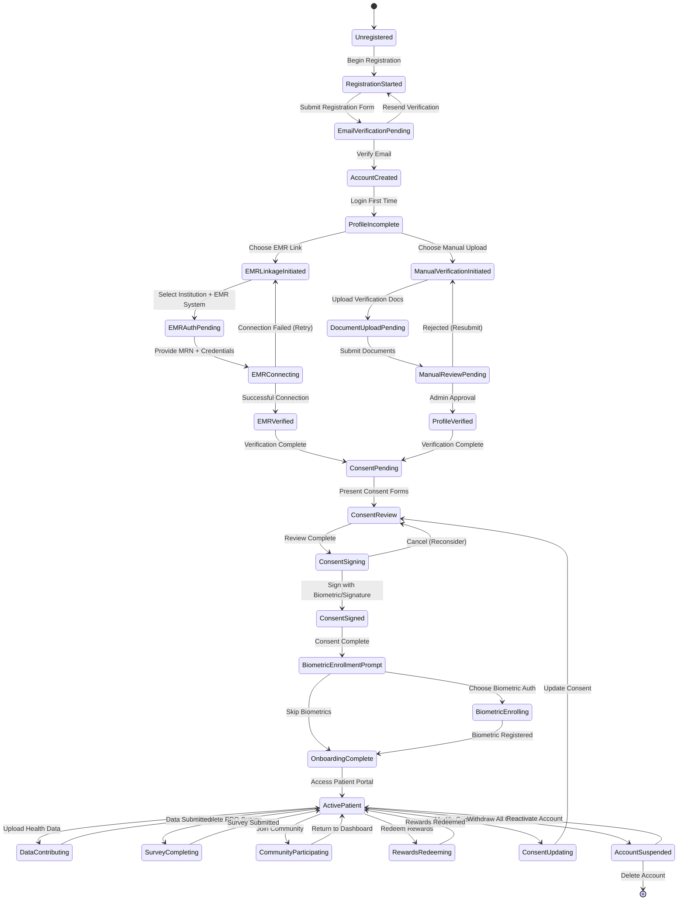

# Patient Onboarding State Machine

## States Explanation

### Registration Phase
- **Unregistered**: User has not started registration
- **RegistrationStarted**: User is filling out registration form
- **EmailVerificationPending**: Awaiting email confirmation
- **AccountCreated**: Email verified, account active but incomplete

### Verification Phase
- **ProfileIncomplete**: User needs to verify identity
- **EMRLinkageInitiated**: User chose to link EMR
- **EMRAuthPending**: Waiting for institution and EMR selection
- **EMRConnecting**: Attempting to connect to EMR system
- **EMRVerified**: EMR connection successful
- **ManualVerificationInitiated**: User chose manual document upload
- **DocumentUploadPending**: Uploading verification documents
- **ManualReviewPending**: Documents under admin review
- **ProfileVerified**: Manual verification approved

### Consent Phase
- **ConsentPending**: Identity verified, needs to complete consent
- **ConsentReview**: User reviewing consent terms
- **ConsentSigning**: User signing consent form
- **ConsentSigned**: Consent signature captured

### Final Setup Phase
- **BiometricEnrollmentPrompt**: Offered biometric authentication
- **BiometricEnrolling**: Registering biometric credentials
- **OnboardingComplete**: All setup complete

### Active Patient States
- **ActivePatient**: Normal active state
- **DataContributing**: Uploading health data
- **SurveyCompleting**: Completing patient-reported outcomes
- **CommunityParticipating**: Engaging in community
- **RewardsRedeeming**: Redeeming earned rewards
- **ConsentUpdating**: Modifying consent preferences
- **AccountSuspended**: All consents withdrawn, account inactive

## Transitions

| From State | To State | Trigger | Validation Required |
|-----------|----------|---------|-------------------|
| Unregistered | RegistrationStarted | User clicks "Sign Up" | None |
| RegistrationStarted | EmailVerificationPending | Form submission | Valid email, password requirements |
| EmailVerificationPending | AccountCreated | Email link clicked | Valid verification token |
| AccountCreated | ProfileIncomplete | First login | Valid credentials |
| ProfileIncomplete | EMRLinkageInitiated | "Link EMR" selected | None |
| ProfileIncomplete | ManualVerificationInitiated | "Upload Documents" selected | None |
| EMRLinkageInitiated | EMRAuthPending | Institution selected | Valid institution ID |
| EMRAuthPending | EMRConnecting | MRN + Credentials provided | Format validation |
| EMRConnecting | EMRVerified | API connection successful | Valid MRN match |
| EMRConnecting | EMRLinkageInitiated | Connection failed | Retry limit not exceeded |
| ManualVerificationInitiated | DocumentUploadPending | Document selected | Valid file type (PDF, JPG, PNG) |
| DocumentUploadPending | ManualReviewPending | Document uploaded | File size < 10MB |
| ManualReviewPending | ProfileVerified | Admin approval | Admin authentication |
| ManualReviewPending | ManualVerificationInitiated | Admin rejection | Rejection reason provided |
| EMRVerified | ConsentPending | Verification complete | Patient profile created |
| ProfileVerified | ConsentPending | Verification complete | Patient profile created |
| ConsentPending | ConsentReview | Consent presented | None |
| ConsentReview | ConsentSigning | "I Agree" clicked | Read confirmation |
| ConsentSigning | ConsentSigned | Signature captured | Valid signature |
| ConsentSigning | ConsentReview | "Cancel" clicked | None |
| ConsentSigned | BiometricEnrollmentPrompt | Consent stored | Immutable consent record |
| BiometricEnrollmentPrompt | BiometricEnrolling | "Enable Biometrics" clicked | Device supports WebAuthn |
| BiometricEnrollmentPrompt | OnboardingComplete | "Skip" clicked | None |
| BiometricEnrolling | OnboardingComplete | Biometric registered | Valid passkey credential |
| OnboardingComplete | ActivePatient | Access portal | All onboarding complete |
| ActivePatient | DataContributing | Upload data initiated | Active consent |
| ActivePatient | SurveyCompleting | Survey started | Survey available |
| ActivePatient | CommunityParticipating | Community joined | Community exists |
| ActivePatient | RewardsRedeeming | Redeem initiated | Sufficient points balance |
| ActivePatient | ConsentUpdating | "Manage Consent" clicked | None |
| ActivePatient | AccountSuspended | All consents withdrawn | Confirmation required |
| AccountSuspended | ActivePatient | Re-consent | New consent signed |
| AccountSuspended | [*] | Account deletion | Delete confirmation + 30-day wait |

## Error Handling

| State | Error Condition | Recovery Action |
|-------|----------------|-----------------|
| EMRConnecting | Invalid credentials | Return to EMRAuthPending with error message |
| EMRConnecting | Network timeout | Retry with exponential backoff (3 attempts) |
| EMRConnecting | EMR system unavailable | Queue for retry, notify user via email |
| DocumentUploadPending | File too large | Show size error, allow reselection |
| DocumentUploadPending | Invalid file type | Show type error, show accepted formats |
| ConsentSigning | Signature capture failed | Allow retry, offer alternative methods |
| BiometricEnrolling | Device not supported | Skip to OnboardingComplete, show explanation |
| BiometricEnrolling | Registration timeout | Retry enrollment process |

## Business Rules

1. **Email Verification Expiry**: Verification links expire after 24 hours
2. **Document Review SLA**: Manual verifications reviewed within 48 business hours
3. **Consent Immutability**: Signed consents cannot be edited, only superseded
4. **Biometric Optional**: Biometric enrollment is optional but recommended
5. **Suspension Reversibility**: Account suspension is reversible within 90 days
6. **Account Deletion**: 30-day grace period before permanent deletion
7. **Retry Limits**: Max 5 EMR connection attempts before requiring support
8. **Concurrent States**: Patient can have multiple sub-states active (e.g., DataContributing + SurveyCompleting)
