# Researcher Data Access State Machine

```mermaid
stateDiagram-v2
    [*] --> Unregistered
    Unregistered --> RegistrationStarted: Begin Researcher Registration
    RegistrationStarted --> InstitutionVerificationPending: Submit Registration

    InstitutionVerificationPending --> InstitutionVerificationReview: Admin Notified
    InstitutionVerificationReview --> AccountCreated: Verification Approved
    InstitutionVerificationReview --> RegistrationStarted: Verification Rejected

    AccountCreated --> IRBPending: First Login

    IRBPending --> IRBDrafting: Create New Protocol
    IRBDrafting --> IRBLocalReview: Submit for Local IRB Review
    IRBDrafting --> IRBPending: Save Draft

    IRBLocalReview --> LocalIRBUnderReview: Protocol Submitted
    LocalIRBUnderReview --> LocalIRBRevisionRequested: Revisions Needed
    LocalIRBUnderReview --> LocalIRBApproved: Approved by Local IRB
    LocalIRBUnderReview --> LocalIRBRejected: Protocol Rejected

    LocalIRBRevisionRequested --> IRBDrafting: Make Revisions
    LocalIRBRejected --> IRBPending: Protocol Terminated

    LocalIRBApproved --> MultiSiteIRBPending: Multi-site Study?
    MultiSiteIRBPending --> MultiSiteIRBReview: Submit to Partner IRBs
    MultiSiteIRBPending --> DataSharingAgreementPending: Single Site Study

    MultiSiteIRBReview --> PartialIRBApproval: Some Sites Approved
    MultiSiteIRBReview --> AllIRBApproved: All Sites Approved
    MultiSiteIRBReview --> MultiSiteIRBRevisionNeeded: Any Site Requests Revision

    MultiSiteIRBRevisionNeeded --> IRBDrafting: Revise Protocol
    PartialIRBApproval --> WaitingRemainingApprovals: Track Progress
    WaitingRemainingApprovals --> AllIRBApproved: Final Approvals Received
    WaitingRemainingApprovals --> MultiSiteIRBRevisionNeeded: Additional Revisions Needed

    AllIRBApproved --> DataSharingAgreementPending: All IRBs Approved

    DataSharingAgreementPending --> DSADrafting: Generate DSA Template
    DSADrafting --> DSALegalReview: Submit to Legal
    DSALegalReview --> DSARevisionNeeded: Legal Requests Changes
    DSALegalReview --> DSASigning: Legal Approved

    DSARevisionNeeded --> DSADrafting: Make Legal Revisions

    DSASigning --> DSAPartialSignatures: Collecting Signatures
    DSAPartialSignatures --> DSAFullyExecuted: All Parties Signed
    DSAPartialSignatures --> DSANegotiationNeeded: Party Requests Changes

    DSANegotiationNeeded --> DSADrafting: Renegotiate Terms

    DSAFullyExecuted --> CohortBuilding: Agreements in Place

    CohortBuilding --> CohortDraftCreated: Define Inclusion Criteria
    CohortDraftCreated --> CohortValidating: Preview Cohort
    CohortValidating --> CohortInvalid: Insufficient Patients / Invalid Criteria
    CohortValidating --> CohortValid: Valid Cohort (n > threshold)

    CohortInvalid --> CohortDraftCreated: Refine Criteria

    CohortValid --> CohortSaved: Save Cohort
    CohortSaved --> DataAccessRequesting: Request Data Access

    DataAccessRequesting --> DataAccessReview: Access Request Submitted
    DataAccessReview --> DataAccessApproved: Compliance Check Passed
    DataAccessReview --> DataAccessDenied: Compliance Failed

    DataAccessDenied --> CohortBuilding: Revise Request

    DataAccessApproved --> DataQuerying: Access Granted

    DataQuerying --> QueryExecuting: Run Cohort Query
    QueryExecuting --> QueryResultsReady: Query Complete
    QueryExecuting --> QueryFailed: Query Error

    QueryFailed --> DataQuerying: Retry Query
    QueryResultsReady --> DataDeidentifying: Apply De-identification

    DataDeidentifying --> DataReviewPending: De-identified Data Ready
    DataReviewPending --> DataDownloadReady: Privacy Review Passed
    DataReviewPending --> DataDeidentifying: Additional De-identification Needed

    DataDownloadReady --> DataDownloaded: Researcher Downloads Data
    DataDownloaded --> DataAnalysis: Begin Analysis

    DataAnalysis --> PublicationDrafting: Analysis Complete
    DataAnalysis --> AdditionalDataNeeded: Require More Data

    AdditionalDataNeeded --> CohortBuilding: Create New Cohort

    PublicationDrafting --> PublicationReview: Submit Manuscript
    PublicationReview --> PublicationApproved: Publication Accepted
    PublicationReview --> PublicationRevisionRequested: Revision Needed

    PublicationRevisionRequested --> PublicationDrafting: Revise Manuscript

    PublicationApproved --> StudyComplete: Study Published

    StudyComplete --> [*]: Archive Study

    DataQuerying --> DataAccessExpired: License Expired
    DataAccessExpired --> DataAccessRenewalRequested: Request Renewal
    DataAccessRenewalRequested --> DataAccessReview: Renewal Under Review
    DataAccessRenewalRequested --> StudyComplete: End Study
```

## States Explanation

### Registration Phase
- **Unregistered**: Researcher has not registered
- **RegistrationStarted**: Filling out researcher registration
- **InstitutionVerificationPending**: Awaiting verification of institutional affiliation
- **InstitutionVerificationReview**: Admin reviewing credentials
- **AccountCreated**: Verified researcher account

### IRB Protocol Phase
- **IRBPending**: No active protocol
- **IRBDrafting**: Creating or revising IRB protocol
- **IRBLocalReview**: Submitted to local IRB
- **LocalIRBUnderReview**: Local IRB reviewing protocol
- **LocalIRBRevisionRequested**: Local IRB requests modifications
- **LocalIRBApproved**: Local IRB approval received
- **LocalIRBRejected**: Protocol rejected by local IRB

### Multi-Site IRB Phase
- **MultiSiteIRBPending**: Determining if multi-site coordination needed
- **MultiSiteIRBReview**: Partner IRBs reviewing protocol
- **PartialIRBApproval**: Some sites approved, awaiting others
- **AllIRBApproved**: All participating sites approved
- **MultiSiteIRBRevisionNeeded**: One or more sites request revisions
- **WaitingRemainingApprovals**: Tracking remaining approvals

### Data Sharing Agreement Phase
- **DataSharingAgreementPending**: IRB approved, need DSA
- **DSADrafting**: Creating data sharing agreement
- **DSALegalReview**: Legal counsel reviewing DSA
- **DSARevisionNeeded**: Legal requests changes
- **DSASigning**: Collecting signatures from all parties
- **DSAPartialSignatures**: Some parties signed, awaiting others
- **DSANegotiationNeeded**: Party wants to renegotiate terms
- **DSAFullyExecuted**: All signatures obtained

### Cohort Building Phase
- **CohortBuilding**: Defining patient selection criteria
- **CohortDraftCreated**: Criteria defined, not validated
- **CohortValidating**: System checking cohort validity
- **CohortInvalid**: Insufficient patients or invalid criteria
- **CohortValid**: Valid cohort meets minimum requirements
- **CohortSaved**: Cohort definition saved

### Data Access Phase
- **DataAccessRequesting**: Requesting access to cohort data
- **DataAccessReview**: Compliance reviewing access request
- **DataAccessApproved**: Access granted
- **DataAccessDenied**: Access denied (compliance issue)

### Data Extraction Phase
- **DataQuerying**: Preparing to execute queries
- **QueryExecuting**: Running database queries
- **QueryResultsReady**: Raw query results obtained
- **QueryFailed**: Query execution error
- **DataDeidentifying**: Applying de-identification algorithms
- **DataReviewPending**: Privacy officer reviewing de-identified data
- **DataDownloadReady**: Data cleared for download
- **DataDownloaded**: Researcher has downloaded data

### Analysis & Publication Phase
- **DataAnalysis**: Analyzing downloaded data
- **AdditionalDataNeeded**: Requires more data
- **PublicationDrafting**: Writing manuscript
- **PublicationReview**: Manuscript under peer review
- **PublicationRevisionRequested**: Revisions needed
- **PublicationApproved**: Manuscript accepted
- **StudyComplete**: Study concluded

### License Management
- **DataAccessExpired**: Data access license expired
- **DataAccessRenewalRequested**: Requesting license renewal

## Transitions

| From State | To State | Trigger | Validation |
|-----------|----------|---------|-----------|
| Unregistered | RegistrationStarted | Click "Register as Researcher" | None |
| RegistrationStarted | InstitutionVerificationPending | Submit registration form | Valid institution email, NPI/credentials |
| InstitutionVerificationReview | AccountCreated | Admin approval | Valid institutional affiliation |
| InstitutionVerificationReview | RegistrationStarted | Admin rejection | Rejection reason provided |
| AccountCreated | IRBPending | First login | None |
| IRBPending | IRBDrafting | "Create Protocol" clicked | None |
| IRBDrafting | IRBLocalReview | "Submit for Review" clicked | Complete protocol form |
| IRBDrafting | IRBPending | "Save Draft" clicked | None |
| LocalIRBUnderReview | LocalIRBRevisionRequested | IRB committee decision | IRB comments provided |
| LocalIRBUnderReview | LocalIRBApproved | IRB approval | Approval documentation |
| LocalIRBUnderReview | LocalIRBRejected | IRB rejection | Rejection reason |
| LocalIRBRevisionRequested | IRBDrafting | "Revise Protocol" clicked | None |
| LocalIRBRejected | IRBPending | "Close Protocol" clicked | None |
| LocalIRBApproved | MultiSiteIRBPending | Approval received | Approval letter uploaded |
| MultiSiteIRBPending | MultiSiteIRBReview | Select partner sites | At least 2 sites selected |
| MultiSiteIRBPending | DataSharingAgreementPending | "Single Site" selected | None |
| MultiSiteIRBReview | PartialIRBApproval | First partner approval | At least 1 approval |
| MultiSiteIRBReview | AllIRBApproved | All partners approved | All sites approved |
| MultiSiteIRBReview | MultiSiteIRBRevisionNeeded | Any site requests revision | Revision comments |
| MultiSiteIRBRevisionNeeded | IRBDrafting | "Make Revisions" clicked | None |
| PartialIRBApproval | WaitingRemainingApprovals | Auto-transition | Pending approvals exist |
| WaitingRemainingApprovals | AllIRBApproved | Last approval received | All approvals complete |
| AllIRBApproved | DataSharingAgreementPending | All IRBs approved | All approval letters |
| DataSharingAgreementPending | DSADrafting | "Generate DSA" clicked | IRB approvals verified |
| DSADrafting | DSALegalReview | "Submit to Legal" clicked | Complete DSA draft |
| DSALegalReview | DSARevisionNeeded | Legal requests changes | Legal comments |
| DSALegalReview | DSASigning | Legal approval | Legal sign-off |
| DSARevisionNeeded | DSADrafting | "Revise DSA" clicked | None |
| DSASigning | DSAPartialSignatures | First signature | At least 1 signature |
| DSAPartialSignatures | DSAFullyExecuted | Last signature | All parties signed |
| DSAPartialSignatures | DSANegotiationNeeded | Party requests changes | Change request submitted |
| DSANegotiationNeeded | DSADrafting | "Renegotiate" clicked | None |
| DSAFullyExecuted | CohortBuilding | All signatures received | Fully executed DSA |
| CohortBuilding | CohortDraftCreated | Define criteria | At least 1 criterion |
| CohortDraftCreated | CohortValidating | "Preview Cohort" clicked | Valid criteria format |
| CohortValidating | CohortInvalid | Validation failed | n < minimum threshold |
| CohortValidating | CohortValid | Validation passed | n ≥ minimum threshold |
| CohortInvalid | CohortDraftCreated | "Refine Criteria" clicked | None |
| CohortValid | CohortSaved | "Save Cohort" clicked | Unique cohort name |
| CohortSaved | DataAccessRequesting | "Request Data Access" clicked | IRB + DSA verified |
| DataAccessRequesting | DataAccessReview | Request submitted | Complete access request |
| DataAccessReview | DataAccessApproved | Compliance approved | All checks passed |
| DataAccessReview | DataAccessDenied | Compliance denied | Violation identified |
| DataAccessDenied | CohortBuilding | "Revise Request" clicked | None |
| DataAccessApproved | DataQuerying | Access granted | Access token issued |
| DataQuerying | QueryExecuting | "Execute Query" clicked | Valid query |
| QueryExecuting | QueryResultsReady | Query complete | Results returned |
| QueryExecuting | QueryFailed | Query error | Error logged |
| QueryFailed | DataQuerying | "Retry" clicked | Retry limit not exceeded |
| QueryResultsReady | DataDeidentifying | Auto-transition | Results not empty |
| DataDeidentifying | DataReviewPending | De-identification complete | De-ID algorithms applied |
| DataReviewPending | DataDownloadReady | Privacy officer approval | No PII/PHI detected |
| DataReviewPending | DataDeidentifying | Additional de-ID needed | PII/PHI detected |
| DataDownloadReady | DataDownloaded | "Download Data" clicked | Download token valid |
| DataDownloaded | DataAnalysis | Data downloaded | Download audit logged |
| DataAnalysis | PublicationDrafting | Analysis complete | Results finalized |
| DataAnalysis | AdditionalDataNeeded | More data required | Justification provided |
| AdditionalDataNeeded | CohortBuilding | "Create New Cohort" clicked | None |
| PublicationDrafting | PublicationReview | Manuscript submitted | Manuscript uploaded |
| PublicationReview | PublicationApproved | Publication accepted | DOI received |
| PublicationReview | PublicationRevisionRequested | Revisions requested | Reviewer comments |
| PublicationRevisionRequested | PublicationDrafting | "Revise Manuscript" clicked | None |
| PublicationApproved | StudyComplete | Publication published | Publication metadata |
| StudyComplete | [*] | "Archive Study" clicked | All data secured |
| DataQuerying | DataAccessExpired | License expiry date reached | Expiration notification sent |
| DataAccessExpired | DataAccessRenewalRequested | "Renew License" clicked | Eligible for renewal |
| DataAccessExpired | StudyComplete | "End Study" clicked | Data deletion confirmed |
| DataAccessRenewalRequested | DataAccessReview | Renewal submitted | Renewal justification |

## Business Rules

1. **IRB Approval Validity**: IRB approvals valid for 1 year, require annual renewal
2. **Multi-Site Coordination**: Studies involving >1 institution require all IRB approvals
3. **DSA Required**: All data access requires fully executed DSA
4. **Minimum Cohort Size**: Cohorts must have n ≥ 10 patients for re-identification protection
5. **Data Access Duration**: Standard access licenses last 12 months
6. **Renewal Window**: License renewal requests accepted 60 days before expiration
7. **Query Limits**: Researchers limited to 100 queries per month per license
8. **Download Audit**: All data downloads logged with researcher ID, timestamp, data scope
9. **Publication Requirement**: Researchers must report publications using HealthDB data
10. **De-identification Standard**: All exported data must pass HIPAA Safe Harbor or Expert Determination

## Error Handling

| State | Error Condition | Recovery Action |
|-------|----------------|-----------------|
| IRBLocalReview | IRB portal unavailable | Queue submission, notify researcher |
| MultiSiteIRBReview | Partner IRB unreachable | Mark site as pending, send notification |
| DSALegalReview | Legal reviewer unavailable | Escalate to backup reviewer after 5 business days |
| DSASigning | Signature platform error | Allow alternative signature methods |
| CohortValidating | Database timeout | Retry with exponential backoff |
| QueryExecuting | Database connection lost | Retry query, log incident |
| DataDeidentifying | De-ID algorithm failure | Alert privacy officer, hold data release |
| DataDownloadReady | Download link expired | Generate new download link (valid 7 days) |

## Compliance Checkpoints

| Checkpoint | State | Verification |
|-----------|-------|-------------|
| Institutional Affiliation | InstitutionVerificationReview | Email domain verification + credentials |
| Local IRB Approval | LocalIRBApproved | IRB approval letter + protocol version match |
| Partner IRB Approvals | AllIRBApproved | All participating sites approved |
| Data Sharing Agreement | DSAFullyExecuted | All party signatures + legal review |
| Minimum Cohort Size | CohortValid | n ≥ 10 patients |
| Data Access Authorization | DataAccessReview | IRB current + DSA active + no violations |
| De-identification | DataReviewPending | No PII/PHI detected by scanner |
| Download Authorization | DataDownloadReady | Active license + audit log entry |
| License Expiration | DataAccessExpired | Expiration date comparison |
