# EMR Data Extraction State Machine

```mermaid
stateDiagram-v2
    [*] --> ExtractionNotStarted

    ExtractionNotStarted --> EMRSystemSelection: Initiate Data Extraction

    EMRSystemSelection --> ConnectionConfiguring: Select EMR System

    ConnectionConfiguring --> CredentialsEntry: Choose Connection Method

    CredentialsEntry --> ConnectionTesting: Provide Credentials
    CredentialsEntry --> CertificateUpload: Certificate-based Auth

    CertificateUpload --> ConnectionTesting: Certificate Validated
    CertificateUpload --> CredentialsEntry: Invalid Certificate

    ConnectionTesting --> ConnectionEstablishing: Test Successful
    ConnectionTesting --> ConnectionFailed: Test Failed

    ConnectionFailed --> CredentialsEntry: Retry with Different Credentials
    ConnectionFailed --> ExtractionNotStarted: Cancel Extraction

    ConnectionEstablishing --> ConnectionActive: Connection Established
    ConnectionEstablishing --> ConnectionFailed: Connection Error

    ConnectionActive --> MRNUpload: Connection Ready

    MRNUpload --> MRNValidating: Upload MRN List
    MRNUpload --> CohortCriteriaEntry: Define Cohort Criteria

    CohortCriteriaEntry --> CohortQueryBuilding: Enter Criteria
    CohortQueryBuilding --> CohortQueryExecuting: Build Query

    CohortQueryExecuting --> MRNListGenerated: Query Successful
    CohortQueryExecuting --> CohortQueryFailed: Query Error

    CohortQueryFailed --> CohortCriteriaEntry: Refine Criteria

    MRNListGenerated --> MRNValidating: MRN List Ready

    MRNValidating --> MRNsValid: All MRNs Valid
    MRNValidating --> MRNsPartiallyValid: Some MRNs Invalid
    MRNValidating --> MRNsAllInvalid: All MRNs Invalid

    MRNsPartiallyValid --> MRNsValid: Exclude Invalid MRNs
    MRNsAllInvalid --> MRNUpload: Resubmit MRN List

    MRNsValid --> VariableSelection: Valid MRNs Confirmed

    VariableSelection --> DataElementsSelected: Select Variables

    DataElementsSelected --> DateRangeSpecification: Variables Confirmed

    DateRangeSpecification --> ExtractionParametersSet: Specify Date Range

    ExtractionParametersSet --> ConsentVerification: Parameters Confirmed

    ConsentVerification --> ConsentCheckPassed: All Patients Consented
    ConsentVerification --> ConsentCheckPartial: Some Patients Not Consented
    ConsentVerification --> ConsentCheckFailed: No Patients Consented

    ConsentCheckPartial --> ConsentCheckPassed: Proceed with Consented Patients
    ConsentCheckFailed --> ExtractionNotStarted: Abort Extraction

    ConsentCheckPassed --> ExtractionQueued: Consent Verified

    ExtractionQueued --> ExtractionInitiating: Extraction Job Created

    ExtractionInitiating --> ExtractionInProgress: Job Started
    ExtractionInitiating --> ExtractionFailed: Job Failed to Start

    ExtractionInProgress --> ExtractingDemographics: Phase 1 - Demographics

    ExtractingDemographics --> DemographicsComplete: Demographics Retrieved
    ExtractingDemographics --> ExtractionFailed: Demographics Extraction Failed

    DemographicsComplete --> ExtractingDiagnoses: Phase 2 - Diagnoses

    ExtractingDiagnoses --> DiagnosesComplete: Diagnoses Retrieved
    ExtractingDiagnoses --> ExtractionFailed: Diagnosis Extraction Failed

    DiagnosesComplete --> ExtractingProcedures: Phase 3 - Procedures

    ExtractingProcedures --> ProceduresComplete: Procedures Retrieved
    ExtractingProcedures --> ExtractionFailed: Procedure Extraction Failed

    ProceduresComplete --> ExtractingMedications: Phase 4 - Medications

    ExtractingMedications --> MedicationsComplete: Medications Retrieved
    ExtractingMedications --> ExtractionFailed: Medication Extraction Failed

    MedicationsComplete --> ExtractingLabResults: Phase 5 - Lab Results

    ExtractingLabResults --> LabResultsComplete: Lab Results Retrieved
    ExtractingLabResults --> ExtractionFailed: Lab Extraction Failed

    LabResultsComplete --> ExtractingVitalSigns: Phase 6 - Vital Signs

    ExtractingVitalSigns --> VitalSignsComplete: Vital Signs Retrieved
    ExtractingVitalSigns --> ExtractionFailed: Vital Signs Extraction Failed

    VitalSignsComplete --> ExtractingClinicalNotes: Phase 7 - Clinical Notes

    ExtractingClinicalNotes --> ClinicalNotesComplete: Notes Retrieved
    ExtractingClinicalNotes --> ExtractionFailed: Notes Extraction Failed

    ClinicalNotesComplete --> ExtractingImagingReports: Phase 8 - Imaging

    ExtractingImagingReports --> ImagingComplete: Imaging Retrieved
    ExtractingImagingReports --> ExtractionFailed: Imaging Extraction Failed

    ImagingComplete --> ExtractionRawComplete: All Data Extracted

    ExtractionFailed --> ExtractionRetrying: Retry Extraction
    ExtractionFailed --> ExtractionAborted: Abort Extraction

    ExtractionRetrying --> ExtractionInitiating: Retry Job
    ExtractionRetrying --> ExtractionAborted: Max Retries Exceeded

    ExtractionRawComplete --> DataValidating: Begin Validation

    DataValidating --> DataQualityChecking: Run Validation Rules

    DataQualityChecking --> DataQualityPassed: Validation Passed
    DataQualityChecking --> DataQualityIssuesFound: Issues Detected

    DataQualityIssuesFound --> DataQualityReview: Manual Review
    DataQualityReview --> DataQualityPassed: Issues Resolved
    DataQualityReview --> ExtractionFailed: Critical Issues

    DataQualityPassed --> DataNormalizing: Quality Check Passed

    DataNormalizing --> DataTransforming: Normalize Formats

    DataTransforming --> DataMappingToFHIR: Transform to Standard

    DataMappingToFHIR --> FHIRMappingComplete: FHIR Mapping Successful
    DataMappingToFHIR --> MappingFailed: FHIR Mapping Failed

    MappingFailed --> DataTransforming: Retry Mapping

    FHIRMappingComplete --> DataDeidentifying: Begin De-identification

    DataDeidentifying --> PHIDetecting: Detect PHI/PII

    PHIDetecting --> PHIRemoval: PHI Detected
    PHIDetecting --> DeidentificationComplete: No PHI Detected

    PHIRemoval --> DateShifting: Remove Direct Identifiers
    DateShifting --> GeneralizingFields: Shift Dates
    GeneralizingFields --> TokenizingIDs: Generalize Quasi-identifiers
    TokenizingIDs --> DeidentificationComplete: Tokenize IDs

    DeidentificationComplete --> DataEncrypting: De-identification Done

    DataEncrypting --> EncryptionComplete: Data Encrypted
    DataEncrypting --> EncryptionFailed: Encryption Error

    EncryptionFailed --> DataEncrypting: Retry Encryption

    EncryptionComplete --> DataStoring: Store Encrypted Data

    DataStoring --> DataStoredSuccessfully: Storage Successful
    DataStoring --> StorageFailed: Storage Error

    StorageFailed --> DataStoring: Retry Storage

    DataStoredSuccessfully --> AuditLogGeneration: Data Secure

    AuditLogGeneration --> AuditLogComplete: Audit Log Created
    AuditLogComplete --> NotificationSending: Log Recorded

    NotificationSending --> NotificationSent: Notify Stakeholders
    NotificationSent --> ExtractionComplete: Extraction Finished

    ExtractionComplete --> [*]: Job Complete
    ExtractionAborted --> [*]: Job Aborted
```

## States Explanation

### Setup Phase
- **ExtractionNotStarted**: No extraction initiated
- **EMRSystemSelection**: Choosing EMR system (Epic, Cerner, etc.)
- **ConnectionConfiguring**: Setting up connection parameters
- **CredentialsEntry**: Entering authentication credentials
- **CertificateUpload**: Uploading SSL/TLS certificates
- **ConnectionTesting**: Testing EMR connectivity
- **ConnectionEstablishing**: Establishing connection
- **ConnectionActive**: Active connection to EMR
- **ConnectionFailed**: Connection attempt failed

### Patient Selection Phase
- **MRNUpload**: Uploading list of Medical Record Numbers
- **CohortCriteriaEntry**: Defining patient selection criteria
- **CohortQueryBuilding**: Building SQL/API query
- **CohortQueryExecuting**: Executing cohort query
- **CohortQueryFailed**: Query execution error
- **MRNListGenerated**: MRN list generated from criteria
- **MRNValidating**: Validating MRN format and existence
- **MRNsValid**: All MRNs validated successfully
- **MRNsPartiallyValid**: Some MRNs invalid
- **MRNsAllInvalid**: All MRNs invalid

### Extraction Configuration Phase
- **VariableSelection**: Selecting data variables to extract
- **DataElementsSelected**: Variables confirmed
- **DateRangeSpecification**: Specifying temporal boundaries
- **ExtractionParametersSet**: All parameters configured
- **ConsentVerification**: Verifying patient consent status
- **ConsentCheckPassed**: All patients have valid consent
- **ConsentCheckPartial**: Some patients consented
- **ConsentCheckFailed**: No valid consents
- **ExtractionQueued**: Job queued for execution

### Extraction Execution Phase
- **ExtractionInitiating**: Starting extraction job
- **ExtractionInProgress**: Extraction running
- **ExtractingDemographics**: Extracting demographic data
- **DemographicsComplete**: Demographics extracted
- **ExtractingDiagnoses**: Extracting diagnosis codes
- **DiagnosesComplete**: Diagnoses extracted
- **ExtractingProcedures**: Extracting procedure codes
- **ProceduresComplete**: Procedures extracted
- **ExtractingMedications**: Extracting medication data
- **MedicationsComplete**: Medications extracted
- **ExtractingLabResults**: Extracting lab values
- **LabResultsComplete**: Labs extracted
- **ExtractingVitalSigns**: Extracting vital signs
- **VitalSignsComplete**: Vitals extracted
- **ExtractingClinicalNotes**: Extracting clinical narratives
- **ClinicalNotesComplete**: Notes extracted
- **ExtractingImagingReports**: Extracting radiology reports
- **ImagingComplete**: Imaging data extracted
- **ExtractionRawComplete**: All raw data extracted
- **ExtractionFailed**: Extraction error occurred
- **ExtractionRetrying**: Retrying failed extraction
- **ExtractionAborted**: Extraction permanently failed

### Data Processing Phase
- **DataValidating**: Beginning validation
- **DataQualityChecking**: Running quality checks
- **DataQualityPassed**: Quality checks passed
- **DataQualityIssuesFound**: Quality issues detected
- **DataQualityReview**: Manual review of issues
- **DataNormalizing**: Normalizing data formats
- **DataTransforming**: Transforming to standard format
- **DataMappingToFHIR**: Mapping to FHIR standard
- **FHIRMappingComplete**: FHIR mapping successful
- **MappingFailed**: FHIR mapping error

### De-identification Phase
- **DataDeidentifying**: Beginning de-identification
- **PHIDetecting**: Detecting PHI/PII elements
- **PHIRemoval**: Removing direct identifiers
- **DateShifting**: Shifting dates consistently
- **GeneralizingFields**: Generalizing quasi-identifiers
- **TokenizingIDs**: Tokenizing identifiers
- **DeidentificationComplete**: De-identification done

### Storage & Completion Phase
- **DataEncrypting**: Encrypting data at rest
- **EncryptionComplete**: Encryption successful
- **EncryptionFailed**: Encryption error
- **DataStoring**: Storing encrypted data
- **DataStoredSuccessfully**: Storage successful
- **StorageFailed**: Storage error
- **AuditLogGeneration**: Creating audit log
- **AuditLogComplete**: Audit log created
- **NotificationSending**: Sending notifications
- **NotificationSent**: Notifications delivered
- **ExtractionComplete**: Job completed successfully

## EMR System Support Matrix

| EMR System | Connection Type | Authentication Methods | FHIR Support | Batch Extract | Real-time API |
|-----------|----------------|----------------------|--------------|---------------|---------------|
| **Epic** | FHIR API, Direct DB | OAuth2, Certificate, Service Account | FHIR R4 | ✅ Yes | ✅ Yes |
| **Cerner** | FHIR API, Direct DB | OAuth2, Certificate, Basic Auth | FHIR DSTU2/R4 | ✅ Yes | ✅ Yes |
| **AllScripts** | API, Direct DB | API Key, Database Credentials | Limited FHIR | ✅ Yes | ⚠️ Partial |
| **MEDITECH** | File Export, Direct DB | Database Credentials, FTP | ❌ No | ✅ Yes | ❌ No |
| **Athenahealth** | API | API Key, OAuth2 | FHIR R4 | ⚠️ Partial | ✅ Yes |
| **eClinicalWorks** | Direct DB, API | Database Credentials, API Key | Limited FHIR | ✅ Yes | ❌ No |

## Data Categories & Variables

### Demographics
- Patient ID (MRN)
- Date of Birth
- Age at diagnosis
- Sex/Gender
- Race/Ethnicity
- Zip code (first 3 digits)
- Insurance type
- Language preference
- Marital status
- Death date (if applicable)

### Diagnoses
- ICD-10 diagnosis codes
- Diagnosis dates
- Primary vs secondary diagnoses
- Cancer stage (TNM, FIGO, etc.)
- Disease progression events
- Comorbidities

### Procedures
- CPT/ICD-10-PCS procedure codes
- Procedure dates
- Procedure locations
- Surgical pathology results
- Radiation therapy sessions
- Biopsy results

### Medications
- Medication name (generic + brand)
- NDC codes
- Dosage and route
- Start and stop dates
- Administration frequency
- Chemotherapy regimens
- Supportive medications

### Laboratory Results
- Lab test name (LOINC codes)
- Result values
- Units
- Reference ranges
- Result dates
- Tumor markers (CEA, CA19-9, PSA, etc.)
- Blood counts (CBC)
- Chemistry panels

### Vital Signs
- Blood pressure
- Heart rate
- Temperature
- Respiratory rate
- Weight
- Height
- BMI
- Oxygen saturation

### Clinical Notes
- Progress notes
- Discharge summaries
- Consultation notes
- Operative reports
- Pathology reports
- Oncology visit notes

### Imaging
- Radiology report text
- Imaging modality (CT, MRI, PET, X-ray)
- Body region
- Imaging date
- Key findings
- Tumor measurements

## De-identification Rules

### Direct Identifiers (Must Remove)
- Patient name
- Address (beyond 3-digit zip)
- Phone numbers
- Email addresses
- Social Security Number
- MRN (replaced with token)
- Account numbers
- Certificate/license numbers
- Vehicle identifiers
- Device identifiers
- URLs
- IP addresses
- Biometric identifiers
- Photos
- Full face images

### Date Handling
- Shift all dates by random offset (consistent per patient)
- Preserve day of week and season
- Retain dates for patients >89 years as ">89"
- Preserve relative time intervals

### Quasi-identifiers (Generalize)
- Age: Report age ranges for >89 years old
- Zip code: First 3 digits only
- Dates: Date shifting with consistent offset
- Rare diseases: Group into broader categories if n<5
- Rare procedures: Generalize if n<5

### Free Text Processing
- Named Entity Recognition (NER) to detect PHI
- Redact or generalize detected entities
- Replace with placeholders: [NAME], [DATE], [LOCATION]

## Quality Validation Rules

| Validation Rule | Threshold | Action if Failed |
|----------------|-----------|------------------|
| **Completeness**: % of required fields populated | ≥80% | Flag for review |
| **Consistency**: Date logic (diagnosis before treatment) | 100% | Auto-correct or flag |
| **Validity**: ICD-10 codes exist in reference table | ≥95% | Flag invalid codes |
| **Plausibility**: Lab values within biological range | ≥90% | Flag outliers |
| **Uniqueness**: No duplicate MRNs | 100% | Deduplicate |
| **Timeliness**: Data within specified date range | 100% | Filter out-of-range |
| **Referential Integrity**: All MRNs have demographics | 100% | Abort extraction |

## Error Handling & Retries

| Error Type | Retry Strategy | Max Retries | Escalation |
|-----------|---------------|-------------|-----------|
| **Connection Timeout** | Exponential backoff (2s, 4s, 8s, 16s, 32s) | 5 | Alert admin |
| **Authentication Failure** | Immediate failure | 0 | Alert user, lock account after 5 attempts |
| **API Rate Limit** | Wait for rate limit reset | 10 | Switch to batch mode |
| **Network Error** | Exponential backoff | 5 | Alert admin |
| **Data Format Error** | Skip record, log error | N/A | Generate error report |
| **Database Lock** | Wait 5s, retry | 3 | Queue for later |
| **Out of Memory** | Reduce batch size, retry | 2 | Alert admin |
| **FHIR Mapping Error** | Skip resource, log error | N/A | Generate mapping report |
| **De-identification Failure** | Halt extraction | 0 | Alert privacy officer |
| **Encryption Failure** | Retry immediately | 3 | Alert security team |
| **Storage Failure** | Exponential backoff | 5 | Alert infrastructure team |

## Audit Log Requirements

Every extraction must log:
1. **Extraction ID**: Unique job identifier
2. **Timestamp**: Start and end times
3. **User**: Researcher who initiated extraction
4. **IRB Protocol**: Associated IRB protocol number
5. **EMR System**: Source EMR system
6. **Institution**: Source institution
7. **MRN Count**: Number of patients
8. **Variable List**: Data elements extracted
9. **Date Range**: Temporal scope
10. **Consent Status**: Consent verification results
11. **Data Volume**: Number of records extracted
12. **Quality Metrics**: Completeness, validity scores
13. **De-identification Method**: HIPAA Safe Harbor or Expert Determination
14. **Encryption Method**: Algorithm and key ID
15. **Storage Location**: Database/file system path
16. **Access Grants**: Who can access the data
17. **Errors**: Any errors encountered
18. **Status**: Completion status (success, failed, partial)

## Performance Benchmarks

| Metric | Target | Critical Threshold |
|--------|--------|-------------------|
| **Connection Establishment** | <10 seconds | <30 seconds |
| **MRN Validation** | <5 seconds per 1000 MRNs | <15 seconds per 1000 MRNs |
| **Data Extraction** | 100 patients/minute | 20 patients/minute |
| **FHIR Mapping** | 200 records/second | 50 records/second |
| **De-identification** | 50 records/second | 10 records/second |
| **Encryption** | 1000 records/second | 200 records/second |
| **Storage** | 500 records/second | 100 records/second |
| **Total Job Duration** (1000 patients) | <30 minutes | <2 hours |
