# IRB Approval Workflow State Machine

```mermaid
stateDiagram-v2
    [*] --> NoProtocol

    NoProtocol --> ProtocolDrafting: Create New Protocol

    ProtocolDrafting --> StudyDesignEntry: Enter Study Details
    StudyDesignEntry --> ParticipantCriteriaEntry: Define Population
    ParticipantCriteriaEntry --> RiskBenefitEntry: Assess Risks/Benefits
    RiskBenefitEntry --> ConsentProcessEntry: Define Consent Process
    ConsentProcessEntry --> DataSafetyEntry: Data Protection Plan
    DataSafetyEntry --> ProtocolDraftComplete: Draft Complete

    ProtocolDraftComplete --> DocumentAttachment: Attach Supporting Docs
    DocumentAttachment --> InvestigatorReview: Internal Review

    InvestigatorReview --> RevisionNeeded: Issues Identified
    InvestigatorReview --> ReadyForSubmission: Review Approved

    RevisionNeeded --> ProtocolDrafting: Make Revisions

    ReadyForSubmission --> PreSubmissionChecklist: Final Checks

    PreSubmissionChecklist --> SubmissionBlocked: Missing Requirements
    PreSubmissionChecklist --> LocalIRBSubmission: All Requirements Met

    SubmissionBlocked --> DocumentAttachment: Complete Requirements

    LocalIRBSubmission --> LocalIRBQueued: Submit to Local IRB

    LocalIRBQueued --> LocalIRBTriage: IRB Coordinator Review

    LocalIRBTriage --> ExpeditedReview: Minimal Risk Study
    LocalIRBTriage --> FullBoardReview: Greater Than Minimal Risk
    LocalIRBTriage --> ExemptReview: Exempt Category

    ExemptReview --> ExemptDetermination: IRB Staff Review
    ExemptDetermination --> Exempted: Granted Exemption
    ExemptDetermination --> FullBoardReview: Exemption Denied

    ExpeditedReview --> ExpeditedReviewing: Assigned to Reviewer
    ExpeditedReviewing --> ExpeditedMinorRevisions: Minor Issues
    ExpeditedReviewing --> ExpeditedMajorRevisions: Major Issues
    ExpeditedReviewing --> ExpeditedApproved: Approved

    ExpeditedMinorRevisions --> RevisionsPending: Request Revisions
    ExpeditedMajorRevisions --> RevisionsPending: Request Major Revisions

    FullBoardReview --> MeetingScheduled: Schedule Board Meeting
    MeetingScheduled --> PrimaryReviewerAssigned: Assign Reviewers

    PrimaryReviewerAssigned --> SecondaryReviewerAssigned: Assign Secondary

    SecondaryReviewerAssigned --> ReviewersReviewing: Reviewers Conducting Review

    ReviewersReviewing --> ReviewerConcernsRaised: Concerns Identified
    ReviewersReviewing --> ReviewersComplete: Reviews Complete

    ReviewerConcernsRaised --> InvestigatorResponse: Request Response
    InvestigatorResponse --> ReviewersReviewing: Response Submitted

    ReviewersComplete --> BoardMeetingConvened: Convene Board Meeting

    BoardMeetingConvened --> BoardDeliberating: Present Protocol
    BoardDeliberating --> VotingInitiated: Discussion Complete

    VotingInitiated --> VoteCounted: Board Votes
    VoteCounted --> BoardApproved: Approved (Majority)
    VoteCounted --> BoardDeferral: Deferred (Requires More Info)
    VoteCounted --> BoardDisapproved: Disapproved (Majority)
    VoteCounted --> BoardModificationsRequired: Modifications Required

    BoardDeferral --> InvestigatorClarification: Request Clarification
    InvestigatorClarification --> BoardMeetingConvened: Resubmit to Board

    BoardModificationsRequired --> RevisionsPending: Request Modifications

    BoardDisapproved --> ProtocolTerminated: Protocol Disapproved

    RevisionsPending --> ResearcherRevising: Researcher Making Revisions
    ResearcherRevising --> RevisionsSubmitted: Submit Revisions

    RevisionsSubmitted --> RevisionReview: IRB Reviews Revisions
    RevisionReview --> RevisionsAccepted: Revisions Acceptable
    RevisionReview --> RevisionsPending: Further Revisions Needed

    RevisionsAccepted --> LocalIRBQueued: Resubmit for Review

    ExpeditedApproved --> LocalApprovalComplete: Local IRB Approved
    BoardApproved --> LocalApprovalComplete: Local IRB Approved
    Exempted --> LocalApprovalComplete: Exempt Status Granted

    LocalApprovalComplete --> MultiSiteCheck: Check Study Sites

    MultiSiteCheck --> SingleSiteStudy: Single Institution
    MultiSiteCheck --> MultiSiteStudy: Multiple Institutions

    SingleSiteStudy --> MonitoringPlanCreation: Create Monitoring Plan

    MultiSiteStudy --> SiteIdentification: Identify Partner Sites
    SiteIdentification --> RelyingIRBDetermination: Determine Reliance

    RelyingIRBDetermination --> SingleIRBUsed: Use Single IRB (sIRB)
    RelyingIRBDetermination --> IndependentIRBsUsed: Each Site Independent

    SingleIRBUsed --> RelianceAgreementDrafting: Draft Reliance Agreement
    RelianceAgreementDrafting --> RelianceAgreementSigning: Send for Signatures
    RelianceAgreementSigning --> AllSitesRelying: All Sites Agree
    RelianceAgreementSigning --> PartialReliance: Some Sites Decline

    PartialReliance --> RelyingIRBDetermination: Reassess Approach

    AllSitesRelying --> MonitoringPlanCreation: Reliance Complete

    IndependentIRBsUsed --> PartnerIRBSubmission: Submit to Partner IRBs

    PartnerIRBSubmission --> PartnerIRB1Submitted: Submit to Partner 1
    PartnerIRB1Submitted --> PartnerIRB1UnderReview: Under Review
    PartnerIRB1UnderReview --> PartnerIRB1Approved: Approved
    PartnerIRB1UnderReview --> PartnerIRB1RevisionsRequested: Revisions Needed
    PartnerIRB1UnderReview --> PartnerIRB1Disapproved: Disapproved

    PartnerIRBSubmission --> PartnerIRB2Submitted: Submit to Partner 2
    PartnerIRB2Submitted --> PartnerIRB2UnderReview: Under Review
    PartnerIRB2UnderReview --> PartnerIRB2Approved: Approved
    PartnerIRB2UnderReview --> PartnerIRB2RevisionsRequested: Revisions Needed
    PartnerIRB2UnderReview --> PartnerIRB2Disapproved: Disapproved

    PartnerIRBSubmission --> PartnerIRB3Submitted: Submit to Partner N
    PartnerIRB3Submitted --> PartnerIRB3UnderReview: Under Review
    PartnerIRB3UnderReview --> PartnerIRB3Approved: Approved
    PartnerIRB3UnderReview --> PartnerIRB3RevisionsRequested: Revisions Needed
    PartnerIRB3UnderReview --> PartnerIRB3Disapproved: Disapproved

    PartnerIRB1RevisionsRequested --> ProtocolDrafting: Address Revisions
    PartnerIRB2RevisionsRequested --> ProtocolDrafting: Address Revisions
    PartnerIRB3RevisionsRequested --> ProtocolDrafting: Address Revisions

    PartnerIRB1Disapproved --> SiteRemoval: Remove Site 1
    PartnerIRB2Disapproved --> SiteRemoval: Remove Site 2
    PartnerIRB3Disapproved --> SiteRemoval: Remove Site N

    SiteRemoval --> MultiSiteCheck: Reassess Sites

    PartnerIRB1Approved --> ApprovalTracking: Track Approvals
    PartnerIRB2Approved --> ApprovalTracking: Track Approvals
    PartnerIRB3Approved --> ApprovalTracking: Track Approvals

    ApprovalTracking --> PartialMultiSiteApproval: Some Sites Approved
    PartialMultiSiteApproval --> AllMultiSiteApproved: All Remaining Approved

    AllMultiSiteApproved --> MonitoringPlanCreation: All Sites Approved

    MonitoringPlanCreation --> DataSafetyMonitoringBoardSetup: DSMB Setup
    DataSafetyMonitoringBoardSetup --> ContinuingReviewScheduling: Schedule Reviews

    ContinuingReviewScheduling --> StudyActive: Study Approved & Active

    StudyActive --> PatientEnrollmentActive: Enrolling Patients
    StudyActive --> DataCollectionActive: Collecting Data
    StudyActive --> AdverseEventReporting: Report Adverse Events
    StudyActive --> ProtocolDeviationReporting: Report Deviations
    StudyActive --> ContinuingReviewDue: Annual Review Due

    AdverseEventReporting --> AdverseEventReview: IRB Reviews Event
    AdverseEventReview --> AdverseEventClosed: Event Closed
    AdverseEventReview --> StudySuspension: Serious Event - Suspend Study

    ProtocolDeviationReporting --> DeviationReview: IRB Reviews Deviation
    DeviationReview --> DeviationClosed: Deviation Closed
    DeviationReview --> StudySuspension: Major Deviation - Suspend

    StudySuspension --> SuspensionInvestigation: Investigate Issue
    SuspensionInvestigation --> CorrectiveActionPlan: Develop CAP
    CorrectiveActionPlan --> CorrectiveActionImplemented: Implement CAP
    CorrectiveActionImplemented --> StudyReactivation: Request Reactivation
    StudyReactivation --> StudyActive: Reactivated
    StudyReactivation --> StudyTerminatedForCause: Termination

    ContinuingReviewDue --> ContinuingReviewSubmission: Submit Annual Report
    ContinuingReviewSubmission --> ContinuingReviewUnderReview: Under Review
    ContinuingReviewUnderReview --> ContinuingReviewApproved: Approved
    ContinuingReviewUnderReview --> ContinuingReviewRevisionsNeeded: Revisions Needed
    ContinuingReviewUnderReview --> StudyExpired: Not Submitted in Time

    ContinuingReviewRevisionsNeeded --> ContinuingReviewSubmission: Submit Revisions

    ContinuingReviewApproved --> StudyActive: Approval Renewed

    StudyExpired --> ExpirationReactivation: Request Reactivation
    ExpirationReactivation --> ContinuingReviewSubmission: Resubmit Review

    PatientEnrollmentActive --> EnrollmentComplete: Target Enrollment Reached
    DataCollectionActive --> DataCollectionComplete: Data Collection Complete

    EnrollmentComplete --> FollowUpPhase: Enter Follow-Up
    FollowUpPhase --> StudyClosureInitiated: Follow-Up Complete

    DataCollectionComplete --> StudyClosureInitiated: Request Closure

    StudyClosureInitiated --> ClosureReportSubmission: Submit Final Report
    ClosureReportSubmission --> ClosureReviewUnderReview: Under Review
    ClosureReviewUnderReview --> ClosureApproved: Closure Approved
    ClosureReviewUnderReview --> ClosureRevisionNeeded: Additional Info Needed

    ClosureRevisionNeeded --> ClosureReportSubmission: Submit Additional Info

    ClosureApproved --> StudyClosed: Study Officially Closed

    StudyClosed --> [*]: Archival

    ProtocolTerminated --> [*]: Protocol Ended
    StudyTerminatedForCause --> [*]: Study Ended

    AdverseEventClosed --> StudyActive: Continue Study
    DeviationClosed --> StudyActive: Continue Study
```

## IRB Review Types

### Exempt Review
**Criteria**: Research involving:
- Normal educational practices
- Educational tests, surveys, interviews (with conditions)
- Benign behavioral interventions
- Secondary research use of identifiable information (with conditions)
- Research/demonstration projects conducted by public entities
- Taste/food quality studies

**Timeline**: 5-10 business days
**Re-review**: Not required unless protocol changes

### Expedited Review
**Criteria**: Research involving:
- Minimal risk
- Specific categories (blood samples, non-invasive procedures, voice recordings, etc.)
- Minor changes to approved protocols
- Annual renewals with no changes

**Timeline**: 10-15 business days
**Reviewer**: Single designated IRB member
**Re-review**: Annual

### Full Board Review
**Criteria**: Research involving:
- Greater than minimal risk
- Vulnerable populations (children, prisoners, pregnant women)
- Invasive procedures
- Investigational drugs/devices
- Potential for serious adverse events

**Timeline**: 30-60 business days
**Reviewers**: Full IRB committee (≥5 members)
**Meeting Frequency**: Monthly
**Re-review**: Annual (or more frequently for high-risk studies)

## IRB Submission Requirements

### Required Documents
1. **Protocol Document** (Complete study plan)
2. **Informed Consent Form(s)** (All versions, translations)
3. **Recruitment Materials** (Flyers, ads, scripts)
4. **Grant Application** (If funded)
5. **Investigator Brochure** (If drug/device study)
6. **Data Safety Monitoring Plan**
7. **Conflict of Interest Disclosure**
8. **Training Certificates** (CITI, HIPAA)
9. **Site Authorization** (If multi-site)
10. **Case Report Forms** (Data collection instruments)
11. **CV/Biosketch** (Principal Investigator and key personnel)
12. **Budget** (Study costs)

### Protocol Elements Required
- Study title and purpose
- Scientific background and rationale
- Study design and methodology
- Subject inclusion/exclusion criteria
- Number of subjects and justification
- Recruitment procedures
- Consent process
- Study procedures and timeline
- Risks to subjects
- Benefits to subjects and society
- Risk mitigation strategies
- Privacy and confidentiality protections
- Data and safety monitoring
- Data storage and retention
- Subject compensation (if any)
- References

## Multi-Site Coordination Models

### Single IRB (sIRB) Model
**When to Use**: NIH-funded multi-site trials (required as of 2018)

**Advantages**:
- Single review process
- Faster approval
- Consistent interpretation
- Reduced administrative burden

**Process**:
1. Select lead IRB (usually coordinating center)
2. Draft IRB Reliance Agreement
3. Participating sites sign reliance agreement
4. Lead IRB reviews protocol
5. Sites rely on lead IRB determination
6. Sites maintain local context review (e.g., recruitment feasibility)

**Reliance Agreement Elements**:
- Designated reviewing IRB
- Scope of reliance (full vs partial)
- Site responsibilities (adverse event reporting, local context issues)
- IRB responsibilities (review, approval, oversight)
- Communication procedures
- Liability and indemnification

### Independent IRB Model
**When to Use**: Sites require local review (institutional policy, state law)

**Advantages**:
- Local context consideration
- Institutional autonomy

**Challenges**:
- Longer timeline
- Inconsistent interpretations
- Increased administrative burden
- Conflicting revision requests

**Coordination Strategies**:
- Harmonization calls before submission
- Shared revision responses
- Staggered submissions to address concerns iteratively
- Liaison to communicate between IRBs

## Continuing Review Requirements

### Review Frequency
- **High Risk**: Every 6 months
- **Greater than minimal risk**: Annually
- **Minimal risk**: Annually
- **Expedited/Exempt**: Varies (may not require continuing review)

### Continuing Review Report Elements
- Number of subjects enrolled (total and by site)
- Number of subjects who completed the study
- Number of subjects who withdrew
- Summary of adverse events and unanticipated problems
- Summary of protocol deviations
- Summary of complaints
- Summaries of relevant recent literature
- Summaries of recent amendments
- Risk-benefit reassessment
- Privacy and data security update
- Current consent form(s)
- Final report (if study closed)

### Approval Expiration
- Studies expire on the anniversary of initial approval
- No new enrollment or study procedures after expiration
- If review submitted but not approved by expiration: grace period or lapses
- Lapsed studies require reactivation process

## Adverse Event Reporting

### Definitions
- **Adverse Event (AE)**: Any untoward medical occurrence
- **Serious Adverse Event (SAE)**: Results in death, life-threatening condition, hospitalization, disability, congenital anomaly
- **Unanticipated Problem (UP)**: Unexpected event, related to research, suggests greater risk

### Reporting Requirements

| Event Type | Severity | Relatedness | Expectedness | Reporting Timeline | Report To |
|-----------|---------|-------------|--------------|-------------------|-----------|
| SAE | Serious | Related | Unexpected | 24 hours (death) / 7 days (other) | IRB, Sponsor, FDA |
| SAE | Serious | Related | Expected | Next continuing review | IRB |
| SAE | Serious | Unrelated | N/A | Not required (unless aggregate) | Optional |
| AE | Not serious | Related | Unexpected | 30 days | IRB |
| AE | Not serious | Related | Expected | Annual report | IRB |
| UP | Any | Related | Unexpected | 5 business days | IRB, Sponsor |

### IRB Actions After AE/UP
- **No action**: Event consistent with known risks
- **Request more information**: Clarify circumstances
- **Require protocol modification**: Mitigate risk
- **Require consent form revision**: Update subjects on new risks
- **Suspend enrollment**: While investigating
- **Suspend study**: Serious concern for safety
- **Terminate study**: Risk outweighs benefit

## Protocol Amendments

### Amendment Types

**Major Amendment** (Requires IRB approval before implementation):
- Change to study aims or design
- Change to inclusion/exclusion criteria
- Increase in subject number
- Addition of study procedures
- Change to consent process
- Addition of study sites
- Change to risk level

**Minor Amendment** (May be implemented after notification):
- Administrative changes (contact info updates)
- Clarifications without substantive change
- Typographical corrections

**Emergency Use** (May be implemented before approval):
- Immediate action needed to eliminate apparent immediate hazard to subject
- Report to IRB within 5 business days

### Amendment Review Process
1. Investigator submits amendment form + revised documents
2. IRB determines review type (expedited vs full board)
3. IRB reviews amendment
4. IRB approves, requests modifications, or disapproves
5. If approved: updated approval letter issued
6. Investigator implements amendment
7. Subjects re-consented if necessary

## Consent Process Requirements

### Elements of Informed Consent (Federal Regulations)
**Basic Elements**:
1. Research statement
2. Study purpose
3. Expected duration
4. Procedures description
5. Experimental procedures identification
6. Reasonably foreseeable risks
7. Benefits to subject or others
8. Alternative procedures or treatments
9. Confidentiality extent
10. Compensation for injury (if more than minimal risk)
11. Contacts for questions
12. Voluntary participation statement
13. Right to withdraw

**Additional Elements** (when appropriate):
14. Unforeseeable risks
15. Circumstances for termination
16. Additional costs
17. Consequences of withdrawal
18. New findings during study
19. Number of subjects
20. Commercial profit statement
21. Whether clinically relevant research results will be disclosed

### Consent Documentation
- **Written consent**: Standard (signed form retained)
- **Short form**: For non-English speakers (interpreter required)
- **Verbal consent**: Limited situations (documented)
- **Waiver**: Research could not practicably be carried out without waiver
- **Assent**: Children 7+ years (with parental permission)

### Special Populations

**Children**:
- Parental permission required (one or both parents depending on risk)
- Child assent required (age ≥7 years)
- Assent document in age-appropriate language

**Prisoners**:
- Additional protections
- Prisoner advocate on IRB
- Risks commensurate with non-prison research
- No undue influence

**Pregnant Women**:
- Additional risk assessment for fetus
- Father's consent (in some cases)
- No inducements to terminate pregnancy

**Decisionally Impaired**:
- Surrogate consent from legally authorized representative
- Subject assent if capable
- Continuing evaluation of capacity

## Data Safety Monitoring

### Data and Safety Monitoring Board (DSMB)
**Required for**:
- Multi-site trials
- Studies with vulnerable populations
- Studies testing high-risk interventions
- Studies with high potential for adverse events

**DSMB Composition**:
- Independent experts (not study investigators)
- Clinical expertise in disease area
- Statistical expertise
- Ethicist (for complex ethical issues)
- Patient advocate (optional)

**DSMB Responsibilities**:
- Review interim safety data
- Assess risk-benefit ratio
- Recommend study continuation, modification, or termination
- Monitor data quality

**DSMB Meeting Frequency**:
- Quarterly to annually (depending on risk)
- Unscheduled meetings for serious concerns

### Data Safety Monitoring Plan (for single-site studies)
**Elements**:
- Person responsible for monitoring
- Monitoring frequency
- Data to be monitored
- Criteria for triggering action
- Reporting procedures

## Compliance and Audits

### IRB Audits
**Types**:
- **For-cause audits**: Triggered by complaints, deviations, adverse events
- **Random audits**: Routine quality assurance
- **Focused audits**: Specific concern (consent process, data security)

**Audit Process**:
1. Notification (immediate for-cause, 30-day notice for routine)
2. Document review (protocol, consents, data, audit trail)
3. Site visit (observe procedures, interview staff)
4. Audit report (findings and recommendations)
5. Corrective action plan (if deficiencies found)
6. Follow-up audit (verify corrective actions)

**Common Deficiencies**:
- Expired IRB approval
- Consent form not current IRB-approved version
- Procedures performed before consent obtained
- Enrollment of ineligible subjects
- Protocol deviations not reported
- Adverse events not reported timely
- Inadequate documentation

### Sanctions for Non-Compliance
- **Verbal warning**
- **Written warning**
- **Required corrective action plan**
- **Increased monitoring/auditing**
- **Suspension of study**
- **Termination of study**
- **Suspension of investigator privileges**
- **Report to OHRP (Office for Human Research Protections)**
- **Report to FDA**
- **Report to funding agency**
