# Data Marketplace Transaction State Machine

```mermaid
stateDiagram-v2
    [*] --> MarketplaceBrowsing

    MarketplaceBrowsing --> ProductViewing: View Data Product
    ProductViewing --> ProductDetailReview: Review Details
    ProductDetailReview --> DatasetPreview: Preview Sample Data
    ProductDetailReview --> PricingReview: Review Pricing
    ProductDetailReview --> MarketplaceBrowsing: Return to Browse

    DatasetPreview --> PreviewViewing: View Sample Records
    PreviewViewing --> ProductDetailReview: Return to Product

    PricingReview --> TierSelection: Select Pricing Tier
    TierSelection --> ProductDetailReview: Change Tier
    TierSelection --> PreliminaryInquiry: Contact Sales
    TierSelection --> PurchaseInitiation: Proceed to Purchase

    PreliminaryInquiry --> InquirySubmission: Submit Inquiry Form
    InquirySubmission --> SalesContactPending: Sales Notified
    SalesContactPending --> SalesDiscussion: Sales Contact Made
    SalesDiscussion --> CustomQuoteRequested: Request Custom Pricing
    SalesDiscussion --> PurchaseInitiation: Proceed with Standard
    SalesDiscussion --> InquiryCancelled: Not Interested

    CustomQuoteRequested --> QuoteDrafting: Sales Creating Quote
    QuoteDrafting --> QuoteReview: Quote Sent to Customer
    QuoteReview --> QuoteNegotiation: Request Modifications
    QuoteReview --> QuoteAccepted: Accept Quote
    QuoteReview --> QuoteRejected: Reject Quote

    QuoteNegotiation --> QuoteDrafting: Revise Quote
    QuoteRejected --> MarketplaceBrowsing: End Transaction
    InquiryCancelled --> MarketplaceBrowsing: End Transaction

    QuoteAccepted --> PurchaseInitiation: Proceed to Purchase

    PurchaseInitiation --> OrganizationVerification: Verify Organization

    OrganizationVerification --> OrganizationDetailsEntry: Enter Org Details
    OrganizationDetailsEntry --> TaxIDVerification: Verify Tax ID
    TaxIDVerification --> OrganizationVerified: Verification Successful
    TaxIDVerification --> OrganizationVerification: Verification Failed

    OrganizationVerified --> BillingContactEntry: Enter Billing Contact

    BillingContactEntry --> PurchaseRequisitionCheck: Check Approval Required

    PurchaseRequisitionCheck --> InternalApprovalPending: Approval Required
    PurchaseRequisitionCheck --> ComplianceReview: No Approval Required

    InternalApprovalPending --> PurchaserRequestingApproval: Request Internal Approval
    PurchaserRequestingApproval --> ApprovalUnderReview: Submitted for Approval
    ApprovalUnderReview --> ApprovalGranted: Approved
    ApprovalUnderReview --> ApprovalDenied: Denied
    ApprovalUnderReview --> ApprovalMoreInfoNeeded: More Info Needed

    ApprovalMoreInfoNeeded --> PurchaserRequestingApproval: Provide Info

    ApprovalDenied --> PurchaseCancelled: Purchase Terminated
    ApprovalGranted --> ComplianceReview: Approval Obtained

    ComplianceReview --> IRBVerification: Verify IRB Approval

    IRBVerification --> IRBDocumentUpload: Upload IRB Approval
    IRBDocumentUpload --> IRBDocumentReview: HealthDB Reviews IRB
    IRBDocumentReview --> IRBApproved: IRB Verified
    IRBDocumentReview --> IRBRejected: IRB Invalid
    IRBDocumentReview --> IRBClarificationNeeded: Need Clarification

    IRBClarificationNeeded --> IRBDocumentUpload: Provide Additional Docs
    IRBRejected --> PurchaseCancelled: Purchase Terminated

    IRBApproved --> DataUseAgreementDrafting: Generate DUA

    DataUseAgreementDrafting --> DUATemplate Generated: Create DUA from Template
    DUATemplateGenerated --> DUACustomization: Customize Terms
    DUACustomization --> DUALegalReview: Submit to Legal

    DUALegalReview --> PurchaserLegalReview: Purchaser Legal Review
    PurchaserLegalReview --> DUANegotiation: Request Changes
    PurchaserLegalReview --> DUAAcceptedByPurchaser: Accept DUA

    DUANegotiation --> HealthDBLegalReview: HealthDB Reviews Changes
    HealthDBLegalReview --> DUACounterProposal: HealthDB Counter-Proposes
    HealthDBLegalReview --> DUAChangesAccepted: HealthDB Accepts Changes

    DUACounterProposal --> PurchaserLegalReview: Send Counter-Proposal
    DUAChangesAccepted --> DUAAcceptedByPurchaser: Changes Incorporated

    DUAAcceptedByPurchaser --> HealthDBLegalFinalReview: HealthDB Final Review
    HealthDBLegalFinalReview --> DUAReadyForSignature: Approved for Signature

    DUAReadyForSignature --> PurchaserSigning: Send to Purchaser
    PurchaserSigning --> PurchaserSigned: Purchaser Signs
    PurchaserSigned --> HealthDBSigning: Send to HealthDB
    HealthDBSigning --> DUAFullyExecuted: HealthDB Signs

    DUAFullyExecuted --> PaymentProcessing: DUA Executed

    PaymentProcessing --> PaymentMethodSelection: Select Payment Method
    PaymentMethodSelection --> CreditCardPayment: Credit Card
    PaymentMethodSelection --> ACHPayment: Bank Transfer (ACH)
    PaymentMethodSelection --> InvoicePayment: Invoice (Net 30/60)
    PaymentMethodSelection --> PurchaseOrderPayment: Purchase Order

    CreditCardPayment --> CreditCardEntry: Enter Card Details
    CreditCardEntry --> PaymentAuthorization: Authorize Payment
    PaymentAuthorization --> PaymentSuccessful: Payment Approved
    PaymentAuthorization --> PaymentFailed: Payment Declined

    PaymentFailed --> PaymentMethodSelection: Try Different Method

    ACHPayment --> BankDetailsEntry: Enter Bank Details
    BankDetailsEntry --> ACHVerification: Verify Account
    ACHVerification --> ACHProcessing: Initiate ACH
    ACHProcessing --> PaymentPending: ACH Processing (3-5 days)
    PaymentPending --> PaymentSuccessful: ACH Cleared
    PaymentPending --> PaymentFailed: ACH Failed

    InvoicePayment --> InvoiceGeneration: Generate Invoice
    InvoiceGeneration --> InvoiceSent: Send Invoice
    InvoiceSent --> InvoicePaymentPending: Awaiting Payment
    InvoicePaymentPending --> PaymentSuccessful: Payment Received
    InvoicePaymentPending --> InvoiceOverdue: Payment Overdue

    InvoiceOverdue --> PaymentReminderSent: Send Reminder
    PaymentReminderSent --> InvoicePaymentPending: Awaiting Payment
    PaymentReminderSent --> CollectionsInitiated: Move to Collections

    CollectionsInitiated --> PaymentSuccessful: Payment Received
    CollectionsInitiated --> LicenseRevoked: Non-Payment

    PurchaseOrderPayment --> PurchaseOrderUpload: Upload PO
    PurchaseOrderUpload --> PurchaseOrderVerification: Verify PO
    PurchaseOrderVerification --> InvoiceGeneration: PO Verified
    PurchaseOrderVerification --> PaymentFailed: PO Invalid

    PaymentSuccessful --> LicenseProvisioning: Payment Confirmed

    LicenseProvisioning --> LicenseGeneration: Generate License Key
    LicenseGeneration --> AccessCredentialsCreation: Create Access Credentials
    AccessCredentialsCreation --> DataAccessConfiguration: Configure Access
    DataAccessConfiguration --> QueryLimitsSetting: Set Query Limits
    QueryLimitsSetting --> UsageTrackingSetup: Setup Usage Tracking
    UsageTrackingSetup --> LicenseActivated: License Active

    LicenseActivated --> WelcomeEmailSent: Send Welcome Email
    WelcomeEmailSent --> DataAccessGranted: Access Granted

    DataAccessGranted --> LicenseActive: Customer Using Data

    LicenseActive --> DataQuerying: Query Data
    LicenseActive --> DataDownloading: Download Data
    LicenseActive --> APIAccess: API Calls
    LicenseActive --> AnalyticsViewing: View Usage Analytics
    LicenseActive --> SupportRequest: Request Support
    LicenseActive --> LicenseExpiryWarning: 30 Days Before Expiry

    DataQuerying --> QueryExecuted: Query Run
    QueryExecuted --> LicenseActive: Return to Dashboard

    DataDownloading --> DownloadInitiated: Start Download
    DownloadInitiated --> DownloadComplete: Download Finished
    DownloadComplete --> LicenseActive: Return to Dashboard

    APIAccess --> APICallMade: API Request
    APICallMade --> APICallLogged: Log API Call
    APICallLogged --> LicenseActive: Return to Dashboard

    AnalyticsViewing --> UsageReportViewed: View Report
    UsageReportViewed --> LicenseActive: Return to Dashboard

    SupportRequest --> SupportTicketCreated: Create Ticket
    SupportTicketCreated --> SupportTicketResolved: Issue Resolved
    SupportTicketResolved --> LicenseActive: Return to Dashboard

    LicenseExpiryWarning --> RenewalInitiated: Initiate Renewal
    LicenseExpiryWarning --> LicenseExpired: Let Expire

    RenewalInitiated --> RenewalComplianceCheck: Verify IRB Still Active
    RenewalComplianceCheck --> RenewalPaymentProcessing: IRB Valid
    RenewalComplianceCheck --> RenewalBlocked: IRB Expired

    RenewalBlocked --> IRBVerification: Update IRB
    RenewalBlocked --> LicenseExpired: Do Not Renew

    RenewalPaymentProcessing --> PaymentMethodSelection: Process Renewal Payment
    PaymentSuccessful --> LicenseRenewed: Renewal Complete
    LicenseRenewed --> LicenseActive: Continue Using

    LicenseExpired --> DataAccessRevoked: Access Removed
    DataAccessRevoked --> ArchivalPeriod: Grace Period (30 days)
    ArchivalPeriod --> LicenseArchived: License Archived
    ArchivalPeriod --> RenewalInitiated: Reinstate License

    LicenseArchived --> [*]: Transaction Complete

    LicenseRevoked --> DataAccessRevoked: Access Removed
    PurchaseCancelled --> [*]: Transaction Cancelled

    LicenseActive --> ViolationDetected: Terms Violation
    ViolationDetected --> ViolationInvestigation: Investigate Violation
    ViolationInvestigation --> ViolationWarningIssued: Minor Violation
    ViolationInvestigation --> LicenseSuspended: Serious Violation

    ViolationWarningIssued --> LicenseActive: Resolved
    LicenseSuspended --> CorrectiveActionRequired: Suspension Notice
    CorrectiveActionRequired --> CorrectiveActionPlanSubmitted: Submit CAP
    CorrectiveActionPlanSubmitted --> LicenseReinstated: CAP Accepted
    CorrectiveActionPlanSubmitted --> LicenseRevoked: CAP Rejected

    LicenseReinstated --> LicenseActive: Continue Using
```

## Data Product Types

### 1. Complete Datasets
- **Description**: Full de-identified patient datasets with all available variables
- **Use Case**: Large-scale observational studies, epidemiological research
- **Pricing**: Highest tier (per patient)
- **Access Level**: Download + API
- **License Duration**: 12-24 months
- **Query Limits**: Unlimited

### 2. Cohort Extracts
- **Description**: Subset of patients meeting specific criteria
- **Use Case**: Targeted studies (e.g., Stage IV cancer patients age 40-60)
- **Pricing**: Per patient, minimum cohort size
- **Access Level**: Download only
- **License Duration**: 12 months
- **Query Limits**: N/A (one-time extract)

### 3. Aggregate Analytics Reports
- **Description**: Pre-computed statistics, no patient-level data
- **Use Case**: Market research, feasibility studies
- **Pricing**: Fixed price per report
- **Access Level**: PDF/Excel download
- **License Duration**: Perpetual
- **Query Limits**: N/A

### 4. API Access
- **Description**: Programmatic query access to de-identified data
- **Use Case**: Software integration, real-time analysis
- **Pricing**: Per API call or monthly subscription
- **Access Level**: API only
- **License Duration**: Monthly subscription
- **Query Limits**: Tiered (100/1000/10000 calls per month)

### 5. Custom Data Extracts
- **Description**: Bespoke datasets with specific variables and timeframes
- **Use Case**: Unique research questions requiring custom data assembly
- **Pricing**: Custom quote (data engineering time + per patient)
- **Access Level**: Negotiated
- **License Duration**: Negotiated
- **Query Limits**: Negotiated

## Pricing Tiers

### Academic / Non-Profit
- **Discount**: 70-80% off enterprise pricing
- **Requirements**: .edu email, IRB approval, non-commercial use attestation
- **Payment Terms**: Net 30, credit card, or grant funds
- **Support**: Email support (48-hour response)
- **License Features**: Standard data access, published use acknowledged

### Startup / Small Business (<50 employees)
- **Discount**: 40-50% off enterprise pricing
- **Requirements**: Company verification, IRB approval
- **Payment Terms**: Credit card, ACH, Net 30
- **Support**: Email support (24-hour response)
- **License Features**: Standard data access, optional white-label

### Enterprise (51-500 employees)
- **Discount**: 10-20% off list price
- **Requirements**: Company verification, IRB approval, DUA negotiation
- **Payment Terms**: Invoice Net 30/60, purchase order
- **Support**: Priority email + phone support (8-hour response)
- **License Features**: Multi-user access, API access, dedicated account manager

### Pharmaceutical / Biotech
- **Discount**: List price (no discount)
- **Requirements**: Company verification, IRB approval, robust DUA
- **Payment Terms**: Purchase order, Net 60
- **Support**: White-glove support (4-hour response), dedicated CSM
- **License Features**: Multi-user access, API access, custom extracts, priority support

### Government
- **Discount**: 30% off list price
- **Requirements**: Government entity verification, IRB approval, FAR compliance
- **Payment Terms**: Government purchase order, Net 60
- **Support**: Government-certified support (24-hour response)
- **License Features**: FedRAMP-compliant access, Section 508 accessibility

## Pricing Models

### 1. Per-Patient Pricing
- **Formula**: Base fee + (# patients × per-patient rate)
- **Example**: $5,000 base + ($50/patient × 1,000 patients) = $55,000
- **Best For**: Cohort extracts, complete datasets
- **Tier Variation**: Per-patient rate decreases as volume increases

### 2. Subscription Pricing
- **Formula**: Monthly or annual fixed fee
- **Example**: $2,000/month for up to 1,000 API calls
- **Best For**: API access, ongoing research programs
- **Tier Variation**: Enterprise gets higher call limits

### 3. One-Time Perpetual License
- **Formula**: Fixed fee for unlimited use
- **Example**: $10,000 for aggregate analytics report
- **Best For**: Market research, feasibility studies
- **Tier Variation**: Academic discount applies

### 4. Per-Query Pricing
- **Formula**: $ per database query executed
- **Example**: $25/query, first 100 queries, then $15/query
- **Best For**: Exploratory research, pilot studies
- **Tier Variation**: Enterprise gets bulk query discounts

### 5. Custom Pricing
- **Formula**: Negotiated based on scope
- **Example**: $150,000 for 6-month exclusive access to rare disease cohort
- **Best For**: Pharmaceutical trials, exclusive collaborations
- **Tier Variation**: Depends on negotiation

## Data Use Agreement (DUA) Terms

### Standard Terms
1. **Permitted Uses**:
   - Research purposes only (or specified commercial uses)
   - No re-identification attempts
   - No sharing with third parties without written permission
   - No creation of derivative datasets for resale

2. **Prohibited Uses**:
   - Re-identification of individuals
   - Marketing directly to patients
   - Discrimination (insurance, employment)
   - Unauthorized disclosure

3. **Data Security**:
   - Encryption at rest and in transit
   - Access controls (role-based)
   - Audit logging
   - Annual security assessments

4. **Publication Requirements**:
   - Acknowledge HealthDB.ai in publications
   - Provide copy of publications to HealthDB
   - No publication embargoes (standard DUA)

5. **Intellectual Property**:
   - Licensee owns analysis results and discoveries
   - HealthDB owns underlying data
   - Joint IP for collaborative projects (negotiated)

6. **Data Retention**:
   - Destroy or return data upon license expiration
   - Exceptions for published results (retain supporting data)

7. **Compliance**:
   - HIPAA compliance (if applicable)
   - GDPR compliance (if EU data)
   - IRB approval maintenance
   - Regular compliance audits

8. **Liability**:
   - HealthDB not liable for data accuracy or completeness
   - Licensee indemnifies HealthDB for misuse
   - Insurance requirements (varies by tier)

9. **Term and Termination**:
   - License duration (12 months standard)
   - Auto-renewal (optional)
   - Termination for breach
   - Data destruction upon termination

10. **Payment Terms**:
    - Payment due dates
    - Late payment penalties
    - Refund policy (generally no refunds for data licenses)

### Customizable Terms (Negotiable)
- Exclusive vs non-exclusive access
- Geographic restrictions
- Publication embargoes (pharma use)
- Data contribution requirements
- Revenue sharing for commercialized products
- Multi-year discounts
- Volume commitments

## Compliance Verification

### IRB Verification Process
1. **Upload IRB Approval Letter**:
   - Must include protocol title, PI name, approval date, expiration date
   - Must match data use described in license

2. **HealthDB Review**:
   - Verify IRB is registered with OHRP (US) or equivalent
   - Confirm protocol scope covers planned data use
   - Check expiration date (must be ≥6 months remaining)

3. **Approval or Rejection**:
   - **Approved**: Proceed to DUA
   - **Clarification Needed**: Request additional documents
   - **Rejected**: IRB insufficient, purchase cancelled

4. **Annual Re-verification** (for multi-year licenses):
   - Upload continuing review approval
   - Verify IRB still active
   - Suspend license if IRB lapses

### Organizational Verification
1. **Organization Name and Address**: Business registry check
2. **Tax ID (EIN/VAT)**: Government database verification
3. **Domain Email**: Corporate email required (no personal Gmail/Yahoo)
4. **Business License**: Verification for commercial entities
5. **DUNS Number**: Optional, for government contracts

## Usage Tracking and Limits

### Tracked Metrics
- **Query Count**: Number of database queries executed
- **API Calls**: Number of API requests
- **Download Count**: Number of data downloads
- **Download Volume**: MB/GB downloaded
- **Active Users**: Number of licensed users accessing data
- **Session Duration**: Time spent accessing data
- **Data Accessed**: Which datasets/variables queried

### Enforcement Mechanisms
- **Soft Limits**: Warning when approaching limit (80%, 90%)
- **Hard Limits**: Block access when limit exceeded
- **Overage Fees**: Charge per unit over limit
  - Example: $1 per query over monthly limit
- **Automatic Upgrades**: Offer tier upgrade when limits consistently exceeded

### Limit Examples by Tier
| Tier | Queries/Month | API Calls/Month | Downloads | Active Users |
|------|---------------|-----------------|-----------|--------------|
| Academic | 100 | 500 | 10 | 5 |
| Startup | 500 | 2,000 | 50 | 10 |
| Enterprise | 2,000 | 10,000 | 200 | 50 |
| Pharma | Unlimited | 50,000 | Unlimited | Unlimited |
| Government | 1,000 | 5,000 | 100 | 25 |

## Violation Detection and Response

### Monitored Violations
1. **Re-identification Attempts**:
   - Queries attempting to isolate individual patients (n=1)
   - Excessive queries on specific MRN tokens
   - Cross-referencing with public data sources

2. **Data Sharing**:
   - Multiple users from unauthorized IP addresses
   - Simultaneous logins from geographically distant locations
   - Shared credentials detection

3. **Unauthorized Use**:
   - Commercial use on academic license
   - Use beyond IRB-approved scope
   - Publication without acknowledgment

4. **Terms Violations**:
   - Exceeding query limits
   - Scraping/bulk downloading (rate limit violations)
   - Accessing data after license expiration

### Response Actions
- **Minor Violation (First Offense)**:
  - Warning email
  - Corrective action request (e.g., add acknowledgment to publication)
  - Notation on account

- **Moderate Violation (Second Offense or Moderate First Offense)**:
  - Temporary suspension (7-30 days)
  - Mandatory corrective action plan
  - Probationary period

- **Serious Violation (Third Offense or Egregious First Offense)**:
  - Immediate license revocation
  - Data destruction verification required
  - Blacklist from future purchases
  - Legal action (for re-identification attempts)

## Revenue Distribution

### Patient Revenue Shares
- **Default**: 30% of net revenue distributed to patients whose data was licensed
- **Distribution Method**:
  - Pro-rata based on data completeness score
  - Quarterly distributions
  - Minimum payout threshold: $10/patient
- **Payment Options**: Points, cash, donation

### Institution Revenue Shares
- **Default**: 10% of net revenue to source institutions
- **Purpose**: Incentivize EMR data contributions
- **Distribution**: Based on number of patients contributed

### Platform Revenue (HealthDB)
- **Default**: 60% of revenue retained by HealthDB
- **Purpose**:
  - Operations and infrastructure
  - Data de-identification and quality
  - Compliance and legal
  - Platform development

### Research Fund Contributions
- **Optional**: Customers can direct % of payment to research fund
- **Purpose**: Support unfunded research at academic institutions
- **Tax Benefit**: Tax-deductible donation (for US customers)

## Renewal Process

### Renewal Timeline
- **90 Days Before Expiry**: First renewal reminder
- **60 Days Before Expiry**: Second renewal reminder + pricing update
- **30 Days Before Expiry**: Final renewal reminder + IRB re-verification required
- **Expiration Date**: Access disabled if not renewed
- **30-Day Grace Period**: Data retained but inaccessible
- **After Grace Period**: Data deleted, license archived

### Renewal Pricing
- **Same Tier**: 10% discount on renewal
- **Upgrade Tier**: Prorate remainder of current license + apply discount
- **Multi-Year**: 15% discount for 2-year, 20% discount for 3-year

### Auto-Renewal
- **Opt-In**: Customer can enable auto-renewal at purchase
- **Notification**: 60-day advance notice of auto-renewal charge
- **Opt-Out Window**: Can disable auto-renewal up to 30 days before expiry
- **Payment Failure**: If auto-renewal payment fails, revert to manual renewal process
