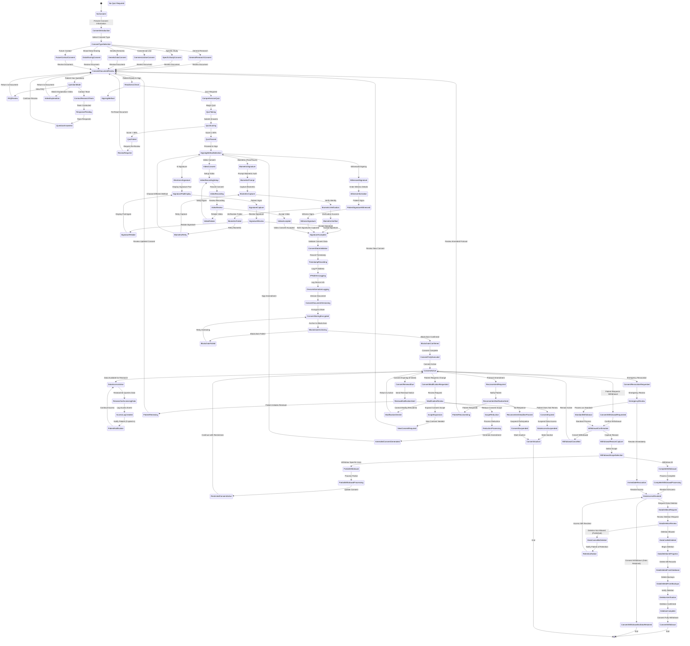

# Consent Management State Machine

## Consent Types

### 1. General Research Consent
**Scope**: Broad permission for de-identified data use in any health research

**Elements**:
- Purpose: Advance medical knowledge
- Data included: All health records
- Sharing: Academic and non-profit researchers
- Commercial use: Excluded (unless separate consent)
- Duration: Until withdrawal
- Right to withdraw: Any time
- Re-contact: Only with separate consent

**Use Case**: Patient wants to contribute to broad medical research without restrictions

### 2. Specific Study Consent
**Scope**: Permission for one particular research study

**Elements**:
- Purpose: Specific study aims (e.g., cancer immunotherapy outcomes)
- Data included: Specified variables only
- Sharing: Named study investigators only
- Duration: Study completion + retention period
- Right to withdraw: Before study completion
- Study-specific risks and benefits

**Use Case**: Patient enrolling in a specific IRB-approved study

### 3. Commercial Use Consent
**Scope**: Permission for commercial entities to access data

**Elements**:
- Purpose: Drug development, product commercialization
- Data included: De-identified health records
- Sharing: Pharmaceutical, biotech, device companies
- Compensation: Revenue share or flat payment
- Duration: Until withdrawal or product approval
- IP rights: Patient waives claims to discoveries
- Right to withdraw: With advance notice (e.g., 90 days)

**Use Case**: Patient willing to share data with companies in exchange for payment

### 4. Genetic/Genomic Data Consent
**Scope**: Permission for genetic data use and sharing

**Elements**:
- Purpose: Genomic research, precision medicine
- Data included: Genetic sequence, variants, family history
- Sharing: Genetic researchers, dbGaP, ClinVar
- Incidental findings: Disclosure preferences
- Family implications: Understand genetic data may reveal family risk
- Duration: Indefinite (genetic data remains constant)
- Right to withdraw: Data use prospectively (cannot un-share past sharing)

**Use Case**: Patient undergoing genetic testing willing to share results

### 5. Broad Data Sharing Consent
**Scope**: Permission for data sharing with external databases and registries

**Elements**:
- Purpose: Enable multi-database queries and linkage
- Data included: De-identified records
- Sharing: NIH databases (dbGaP), cancer registries, EHR networks
- Security: Encrypted transmission, access controls
- Duration: Until withdrawal
- Right to withdraw: Prospective only (cannot retract shared data)

**Use Case**: Patient wants data widely available to research community

### 6. Future Contact Consent
**Scope**: Permission to re-contact for future studies or results

**Elements**:
- Purpose: Recruitment for related studies, return of results
- Contact methods: Email, phone, mail
- Frequency limits: Maximum contacts per year
- Opt-out: Can decline specific contacts
- Duration: Until withdrawal
- Information shared: Study opportunities, general results

**Use Case**: Patient open to hearing about future research opportunities

## Consent Document Requirements

### Required Elements (Federal Regulations)
1. **Study Purpose**: Why data is being collected
2. **Procedures**: What will happen with the data
3. **Duration**: How long consent is valid
4. **Risks**: Privacy risks, psychological risks from incidental findings
5. **Benefits**: To patient (usually none) and to society
6. **Alternatives**: Not participating
7. **Confidentiality**: How privacy is protected
8. **Voluntary Participation**: No penalty for declining
9. **Right to Withdraw**: Can withdraw at any time
10. **Contacts**: Who to contact with questions
11. **Compensation**: Any payment for participation
12. **Future Use**: Whether data can be used in future studies

### HealthDB-Specific Elements
13. **Data Sharing Scope**: Who will have access (academic, commercial, government)
14. **De-identification**: How data will be anonymized
15. **Revenue Sharing**: If commercial use allowed, patient's share
16. **Data Retention**: How long data will be kept
17. **Withdrawal Impact**: What happens to data after withdrawal
18. **Access Transparency**: Patient can see who accessed their data
19. **Incidental Findings**: Whether findings will be returned to patient
20. **Genetic Data**: Special considerations if genetic data included
21. **Re-contact**: Whether patient can be re-contacted
22. **Protocol Changes**: How patient will be notified of changes

## Signature Methods

### 1. Electronic Signature (Most Common)
**Process**:
1. Patient reviews consent on screen
2. Types full name in signature field
3. Clicks "I Agree" checkbox
4. System captures timestamp, IP address, device info
5. Consent stored with signature

**Compliance**: Meets ESIGN Act and UETA requirements

**Advantages**: Fast, convenient, legally binding

**Disadvantages**: Less secure than biometric methods

### 2. Biometric Signature (Highest Security)
**Process**:
1. Patient reviews consent on screen
2. Authenticates with fingerprint, Face ID, or iris scan
3. Biometric template matched against enrolled credential
4. System captures biometric authentication event
5. Consent stored with biometric signature

**Compliance**: Meets ESIGN Act with higher assurance

**Advantages**: Strong identity verification, non-repudiation

**Disadvantages**: Requires biometric hardware, privacy concerns

### 3. Witnessed Signature (Legal Assurance)
**Process**:
1. Patient reviews consent in presence of witness
2. Patient signs electronically or on paper
3. Witness verifies patient identity
4. Witness signs as witness
5. Both signatures captured

**Compliance**: Required for some high-risk studies

**Advantages**: Legal protection, identity verification

**Disadvantages**: Requires witness availability, slower

### 4. Video Consent (Verbal Consent)
**Process**:
1. Patient records video statement
2. Reads key consent elements aloud
3. States full name and verbal agreement
4. Video stored with consent record

**Compliance**: Acceptable for some IRBs, not all

**Advantages**: Captures patient understanding, accessible for illiterate patients

**Disadvantages**: Video storage requirements, transcription needed

## Comprehension Assessment

### Purposes
- Ensure patient understands consent
- Identify areas needing clarification
- Demonstrate informed consent process
- Protect patient rights
- Reduce liability

### Quiz Structure
**Required Score**: ≥80% (4/5 or 8/10 correct)

**Sample Questions**:
1. **Purpose**: "What is the main purpose of this study?"
   - A) To treat my disease
   - B) To collect data for research ✓
   - C) To advertise pharmaceutical products
   - D) To share my data with my doctor

2. **Voluntariness**: "What happens if I decide not to participate?"
   - A) I will not receive medical care
   - B) My doctor will be notified
   - C) Nothing, participation is voluntary ✓
   - D) I will be charged a fee

3. **Withdrawal**: "Can I change my mind after signing consent?"
   - A) No, consent is permanent
   - B) Yes, I can withdraw at any time ✓
   - C) Only within 24 hours
   - D) Only if I pay a fee

4. **Data Sharing**: "Who will have access to my de-identified data?"
   - A) Only my doctor
   - B) Insurance companies
   - C) Approved researchers ✓
   - D) Anyone who requests it

5. **Risks**: "What is the main risk of participating?"
   - A) Physical harm from procedures
   - B) Privacy risk if data is re-identified ✓
   - C) Financial costs
   - D) Disease progression

**Failed Quiz Response**:
- Patient required to re-review consent material
- Highlight sections related to missed questions
- Offer to speak with research coordinator
- Allow retake (no limit on attempts)

## Blockchain Anchoring

### Purpose
- **Immutability**: Prove consent was not altered after signing
- **Timestamp**: Cryptographic proof of when consent was signed
- **Non-repudiation**: Patient cannot deny signing
- **Auditability**: Transparent consent history

### Process
1. **Hash Generation**: Create SHA-256 hash of signed consent document
2. **Blockchain Transaction**: Submit hash to blockchain (Ethereum or Hyperledger)
3. **Confirmation**: Wait for blockchain confirmation (6 blocks)
4. **Store Transaction ID**: Link transaction ID to consent record in database
5. **Verification**: Anyone can verify consent integrity by recomputing hash and checking blockchain

### Information Stored On-Chain
- Consent document hash (NOT the document itself)
- Timestamp
- Patient ID hash (NOT identifiable info)
- Consent type
- Version

### Information Stored Off-Chain (Database)
- Full consent document
- Patient identifying information
- Signature
- Blockchain transaction ID

## Consent Withdrawal Process

### Partial Withdrawal
**Patient Can Withdraw**:
- Specific consent types (e.g., withdraw commercial use, keep general research)
- Specific data categories (e.g., withdraw genetic data, keep clinical data)
- Specific uses (e.g., withdraw pharma sharing, keep academic sharing)

**Effect**:
- Data access restricted prospectively
- Existing research can continue (if IRB allows)
- Patient remains in database with restricted consent

**Process**:
1. Patient selects which consents to withdraw
2. System generates consent amendment
3. Patient signs amendment
4. Access controls updated immediately
5. Researchers notified of restricted access

### Complete Withdrawal
**Patient Withdraws**:
- All consents
- All data sharing permissions
- Future contact permissions

**Effect**:
- All data access revoked immediately
- Patient data flagged as withdrawn
- Option to request data deletion

**Process**:
1. Patient requests complete withdrawal
2. System presents confirmation (ensure patient understands)
3. Patient confirms withdrawal
4. All active data licenses for patient's data revoked
5. Researchers notified
6. Data deletion request initiated (if patient requests)

### Data Deletion Considerations

**Data CAN Be Deleted**:
- Data not yet incorporated into published research
- Data not shared beyond HealthDB
- Raw data in HealthDB database

**Data CANNOT Be Deleted** (Must Be Retained):
- Data already published in peer-reviewed journals
- Data shared with external registries (dbGaP, ClinVar)
- Data required by regulation (FDA-approved trials)
- Aggregate/summary data where patient cannot be isolated

**Deletion Process**:
1. Identify all databases containing patient data
2. Delete patient record from main database
3. Delete from encrypted backups (next backup cycle)
4. Delete from data warehouse/analytics databases
5. Delete local copies downloaded by researchers (request deletion)
6. Verify deletion with audit
7. Provide patient with deletion confirmation

**Retention Notification**:
- If data must be retained, notify patient
- Explain legal basis for retention
- Confirm access is still revoked (data retained but inaccessible)

## Re-consent Requirements

### Triggers for Re-consent
1. **Protocol Amendment**: Significant changes to study procedures or risks
2. **New Information**: New risks discovered during study
3. **Consent Expiration**: Timed consents expiring
4. **Regulatory Change**: New regulations require updated consent
5. **Patient Request**: Patient wants to modify consent scope

### Re-consent Process
1. **Notification**: Email/mail patient about re-consent requirement
2. **Deadline**: Provide 30-60 day window to re-consent
3. **Document Review**: Present updated consent document with changes highlighted
4. **Questions**: Offer opportunity to ask questions
5. **Signing**: Patient signs updated consent
6. **Failure to Re-consent**: If patient does not respond, suspend participation

### Comparison Document
**Required Elements**:
- Side-by-side comparison of old vs new consent
- Highlighted changes
- Explanation of why re-consent is needed
- Impact of not re-consenting

## Consent Versioning

### Version Control System
- **Major Version**: Significant changes (v1.0 → v2.0)
- **Minor Version**: Clarifications, formatting (v1.0 → v1.1)
- **Patch Version**: Typo corrections (v1.0.0 → v1.0.1)

### Version Information Stored
- Version number
- Date created
- Author (who drafted)
- Changes from previous version
- IRB approval date for version
- Patients consented under this version
- Superseded by (next version)

### Patient Version Tracking
- Each patient consent linked to specific version
- Patient remains on consented version unless re-consented
- Audit trail shows all versions patient has signed

## Access Transparency

### Patient Dashboard
**Patients Can View**:
1. **Access Log**: Who accessed their data, when, for what study
2. **Consent Status**: Current consents and restrictions
3. **Data Summary**: What data categories are in their record
4. **Sharing History**: Which researchers/organizations accessed data
5. **Revenue**: How much revenue their data generated (if commercial use)
6. **Publications**: Research publications using their data

### Access Log Details
- **Date/Time**: When data was accessed
- **Researcher Name**: Who accessed (PI name)
- **Institution**: Researcher's affiliation
- **Study**: IRB protocol title
- **Data Accessed**: Categories accessed (demographics, labs, medications, etc.)
- **Purpose**: Research purpose

### Notifications
**Opt-in Notifications**:
- Email when data accessed (immediate, daily digest, weekly digest)
- Email when new study uses data
- Email when publication released
- Email for consent renewal
- Email for re-consent requirements

## Consent Metrics and Reporting

### Metrics Tracked
1. **Consent Rate**: % of patients approached who consent
2. **Withdrawal Rate**: % of consented patients who withdraw
3. **Partial Withdrawal Rate**: % of patients restricting consent
4. **Re-consent Rate**: % of patients who re-consent when required
5. **Consent Type Distribution**: Breakdown by consent type
6. **Time to Consent**: Median time from presentation to signature
7. **Quiz Failure Rate**: % of patients failing comprehension quiz
8. **Video Consent Rate**: % choosing video vs electronic signature

### Regulatory Reporting
- Annual report to IRB: Consent metrics, withdrawals, issues
- FDA audits (if applicable): Consent documentation review
- OHRP (Office for Human Research Protections): Report non-compliance

### Quality Improvement
- Identify consent types with high withdrawal rates
- Revise consent language with high quiz failure rates
- Analyze reasons for withdrawal (adjust procedures)
- A/B test consent presentation formats
